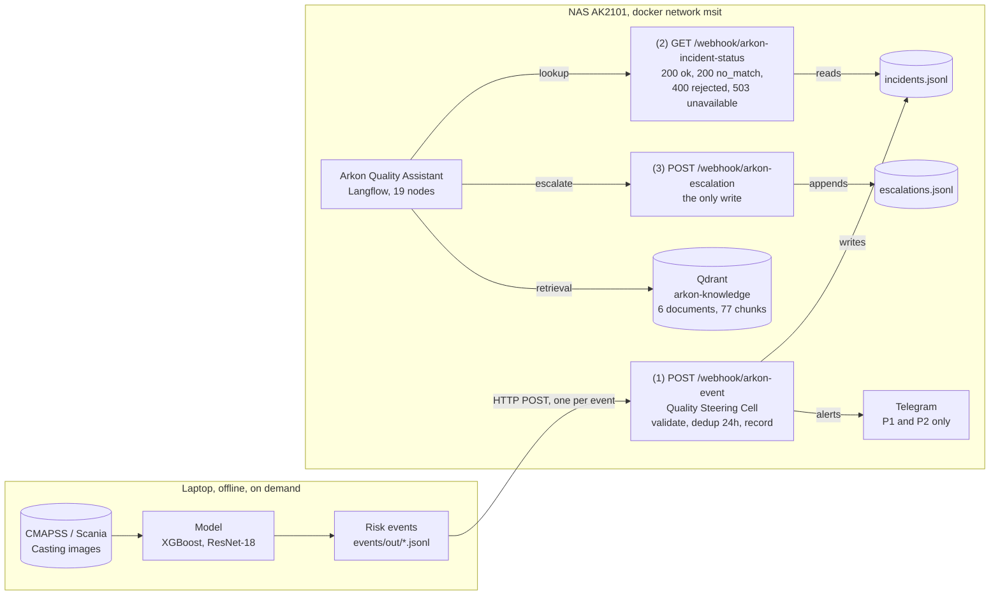
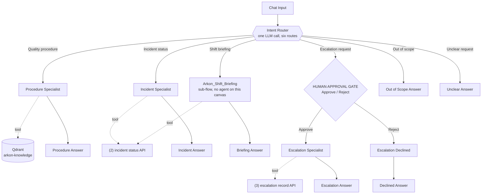

# 🏭 Arkon Manufacturing AI

> Mastery-level portfolio project - an integrated AI quality control platform
> for a fictional heavy manufacturing company, built on real public datasets.

---

## Overview

Arkon Manufacturing AI simulates an Industry 4.0 platform that combines
Predictive Maintenance, Fault Detection, and Visual Quality Control across
three factory departments - all unified in a single Streamlit application
with a RAG-powered AI assistant.

---

## Architecture

```
Arkon Manufacturing AI Platform
│
├── ⏱️  Time Series      Engine Testing Dept.   NASA CMAPSS       RUL Prediction
├── 🔧  ML Classification Truck Fleet Dept.      Scania APS        Fault Detection
├── 🔍  CV Binary         Foundry Dept.          Casting Product   Defect Detection
├── 🔬  CV Multi-class    Rolling Mill Dept.     NEU Surface       Defect Type (v1.5)
├── 🤖  LLM / RAG         All Departments        -                 AI Chatbot
└── 📊  BI Dashboard      Executive Level        Tableau           KPI Analytics
```

### Runtime wiring, as deployed 2026-08-31

The map above is the capability plan. This is what actually runs, and how the
pieces reach each other. Everything below the dashed line is on the NAS; the
laptop half runs on demand and offline.



The assistant reaches the incident store only through endpoint 2, so it cannot
invent a status: it has no other source. Inside the canvas, one classification
picks one branch and the rest are deactivated.



**The last two routes carry a fixed message on the router itself**, so each
reaches its output with no agent in between and no second model call. They are
two routes rather than one because the operator is owed the right reason: out of
scope means the subject is not covered, unclear means it is Arkon work with a
piece missing, and answering the second as the first teaches people to stop
asking.

**The briefing has its own branch for a different reason.** Reaching it as a
tool of the incident specialist put a fixed four-block format inside an agent
whose job is to answer in its own words: the operator got the briefing twice,
and the paraphrase relabelled an incident's age as an overdue figure. A
component whose value is its exact output must not be reached through something
that rewords.

**Where the two systems meet is one file and three URLs.** n8n owns the incident
store; Langflow never touches it. The assistant only ever sees what an endpoint
chooses to return, which is why the store can change shape without touching the
canvas, and why the assistant cannot invent a status: it has no other source.

**Two host settings make the arrows work**, and neither is obvious from an error
message. n8n carries the Docker network alias `n8n.arkon.internal`, because
Langflow's API Request component validates URLs with `validators.url()` and
rejects any hostname without a dot. And Langflow runs with
`LANGFLOW_SSRF_ALLOWED_HOSTS=n8n.arkon.internal`, because it blocks outbound
calls into private IP ranges by default. Details in `n8n/README.md` and
`langflow/README.md`.

**Direction of trust.** Everything the assistant can change goes through
endpoint 3, and endpoint 3 is reachable only from the Approve branch of the
human gate. Telegram is wired to endpoint 1 only, so no message reaches a person
because of anything the assistant did.

---

## Datasets

| Module | Dataset | Source | License | Size | Task |
|--------|---------|--------|---------|------|------|
| Time Series | [NASA CMAPSS Turbofan Engine Degradation](https://www.kaggle.com/datasets/behrad3d/nasa-cmaps) | NASA Prognostics CoE / Kaggle mirror | CC0 1.0 | ~3 MB | RUL regression |
| ML | [APS Failure at Scania Trucks](https://archive.ics.uci.edu/dataset/421/aps+failure+at+scania+trucks) | Scania CV AB via UCI ML Repository | CC BY 4.0 | ~54 MB | Binary classification |
| CV | [Casting Product Quality Control](https://www.kaggle.com/datasets/ravirajsinh45/real-life-industrial-dataset-of-casting-product) | Kaggle | CC BY-NC 4.0 | ~100 MB | Binary image classification |
| CV (planned) | [NEU Surface Defect Database](http://faculty.neu.edu.cn/songkechen/zh_CN/zdylm/263270/list/index.htm) | Northeastern University, China | Academic use | ~30 MB | 6-class classification |
| CV (planned) | [MVTec Anomaly Detection](https://www.mvtec.com/company/research/datasets/mvtec-ad) | MVTec Software GmbH | Research only | ~4.9 GB | Anomaly detection |
| CV (planned) | [GC10-DET Surface Defects](https://github.com/lvxiaoming2019/GC10-DET-Metallic-Surface-Defect-Datasets) | Academic | Academic use | ~1 GB | Object detection |

> **Note:** NASA CMAPSS is a physics-based simulation (not raw sensor data),
> but is the gold-standard benchmark for RUL prediction research.
> Always verify dataset licenses before commercial use.

---

## What's Built

- [x] Project structure & environment setup
- [x] Dataset downloads (all 7 datasets)
- [x] Project Charter - risk events, P1-P4 priorities, steering-cell rules (`docs/Project_Charter.md`)
- [x] Time Series module - CMAPSS EDA + preprocessing + RUL baseline on FD001 (LR RMSE 20.79, XGBoost RMSE 17.11, MLflow-tracked)
- [x] Time Series module, full fleet - all four CMAPSS subsets, 709 engines, six operating regimes, two fault modes, with temporal features over a 20-cycle window. XGBoost RMSE 11.01 on the benchmark task, scoring the hardest subset about as well as the easiest (`notebooks/01_timeseries/cmapss_full_fleet.py`, `docs/Model_Card_CMAPSS_RUL.md`)
- [x] Risk-event layer - schema, validator, CMAPSS adapter, 707 validated events across the full fleet (`events/`)
- [x] n8n Quality Steering Cell - deployed on the NAS and verified end to end: contract validation, 24 h duplicate suppression, JSONL incident store, Telegram cards for P1 and P2 (`n8n/`)
- [x] Operating documentation - CMAPSS model card and Steering Cell SOP (`docs/`)
- [x] **Tabular module - Scania APS fault classifier.** XGBoost over 170 anonymised counters, total cost 10,660 on the dataset's own metric of 10 per needless workshop check and 500 per missed failure, which lands between second and third of the IDA 2016 challenge on the same test set. The decision threshold is worth a factor of 3.8; every structural choice is inside the noise of the selection (`notebooks/02_ml/scania_aps.py`, `docs/Model_Card_Scania_APS.md`)
- [x] **CV module - casting defect inspection.** ResNet-18 fine-tuned end to end, 0 defects missed and 7 good parts rejected on 715 test images, ROC AUC 0.9999. Its priority bands run the opposite way to the other modules, and the reason is measured (`notebooks/03_cv/01_casting_defects/casting_cv.py`, `docs/Model_Card_Casting_CV.md`)
- [x] **Read and write endpoints** - `GET /webhook/arkon-incident-status` over the incident store, and `POST /webhook/arkon-escalation`, the first audited write (`n8n/README.md`)
- [x] **Grounded assistant - the Arkon Quality Assistant on Langflow.** Nineteen nodes, six routes, retrieval over a Qdrant store of six Arkon documents, a live incident lookup, a human approval gate in front of the one write, and a shift-briefing sub-flow. It closes the last open MVP criterion of charter section 10, an operational interface (`langflow/README.md`)
- [ ] NLP module - NHTSA complaint classification and field-quality trend detection
- [ ] Incident lifecycle - acknowledge and close callbacks, escalation timer, queryable store
- [ ] Streamlit app and Tableau views - the operational cockpit and the executive KPI view

### One deployed piece that is not an Arkon feature

Seven pieces are deployed: three Langflow flows and four n8n workflows. Six of
them run the plant. The exception is the twelve-node
`n8n/comparison_slice_v1.json`, which exists to test a claim about the platform
rather than to serve an operator, and could be deleted without loss. It is kept
because the claim it settles is documented in `n8n/README.md` and the evidence is
worth more than the twelve nodes cost.

---

## Planned Extensions

| Module | Dataset | Task | Prerequisite |
|--------|---------|------|-------------|
| CV Multi-class | NEU Surface Defect | 6 defect type classification | Current CV skills |
| CV Anomaly Detection | MVTec AD | Unsupervised anomaly detection | Autoencoders |
| CV Object Detection | GC10-DET | Bounding box defect localization | YOLO / detection models |
| BI Dashboard | All modules | Executive KPI analytics | Tableau |

---

## Stack

```
Language    Python 3.12
ML          scikit-learn, XGBoost, imbalanced-learn
Time Series statsmodels
CV          PyTorch, torchvision, albumentations, OpenCV
MLOps       MLflow (experiment tracking, model registry)
App         Streamlit
LLM / RAG   LangChain, ChromaDB, OpenAI
BI          Tableau
Utilities   pandas, numpy, matplotlib, seaborn, plotly
```

---

## Setup

**Windows (RTX GPU):**
```powershell
cd path\to\arkon-manufacturing-ai
.\setup_windows_venv.bat
python verify_setup.py
python -m ipykernel install --user --name arkon-win --display-name "Arkon AI (Win+CUDA)"
```

**Mac (Apple Silicon):**
```bash
python3.12 -m venv ~/venvs/arkon-manufacturing-ai_mac_venv
source ~/venvs/arkon-manufacturing-ai_mac_venv/bin/activate
pip install torch torchvision torchaudio
pip install -r requirements-windows.txt
python -m ipykernel install --user --name arkon-mac --display-name "Arkon AI (Mac+MPS)"
```

**Run notebooks** - open in VS Code or JupyterLab, select the kernel above,
run in order: `01_eda → 02_preprocessing → 03_modeling` per module.

**Run Streamlit app:**
```bash
streamlit run app/main.py
```

---

## MLflow - Experiment Tracking

All model training runs are logged automatically to a local SQLite database.
No server setup required - just run the modeling notebooks.

**View the MLflow UI:**
```bash
# From the project root (with venv active):
mlflow ui --backend-store-uri sqlite:///mlflow.db
```
Then open **http://localhost:5000** in your browser.

**Experiment structure:**

| Experiment | Module | Runs |
|---|---|---|
| `arkon-timeseries-cmapss` | Engine Testing | baseline_linear_regression, xgboost_v1 |
| `arkon-ml-scania` | Truck Fleet | baseline_logistic_regression, xgboost_v1 |
| `arkon-cv-casting` | Foundry | resnet18_v1 |
| `arkon-cv-neu` | Rolling Mill | resnet18_v1 |
| `arkon-cv-mvtec` | QC Anomaly | patchcore_lite_v1 |
| `arkon-cv-gc10` | Stamping | resnet18_weighted_v1 |

Each run logs: hyperparameters, metrics per epoch, training time, and the saved model artifact.

---

## Project Structure

```
arkon-manufacturing-ai/
├── app/                        Streamlit application
│   ├── main.py                 Entry point
│   ├── pages/                  One file per module
│   └── utils/                  Shared utilities
├── assets/                     Saved plots for README and Streamlit
│   ├── timeseries/
│   ├── ml/
│   └── cv/
├── data/
│   ├── 01_cmapss/              NASA CMAPSS txt files
│   ├── 02_scania/              Scania APS csv files
│   ├── 03_casting/             Casting Product images
│   ├── 04_neu/                 NEU Steel Defect images
│   ├── 05_mvtec/               MVTec Anomaly Detection images
│   └── 06_gc10/                GC10-DET Steel Defect images
├── models/
│   ├── checkpoints/            Training checkpoints (auto-saved, skip retraining)
│   └── *.pkl / *.pt            Final saved models
├── notebooks/
│   ├── utils/arkon_utils.py    Shared utilities (device, MLflow, timer, checkpoint)
│   ├── 01_timeseries/          CMAPSS - RUL prediction
│   ├── 02_ml/                  Scania APS - fault classification
│   └── 03_cv/                  Computer Vision - 4 datasets
├── mlflow.db                   MLflow experiment database
├── setup_windows_venv.bat      Windows venv + CUDA setup
├── requirements-windows.txt    Python dependencies
├── verify_setup.py             Environment verification script
└── .python-version             Python 3.12
```

---

## Author

**Sergey Kasatov** - Data Analyst with 17 years of background in automotive
engineering. This project applies ML, Time Series, and Computer Vision to
industrial manufacturing problems - a domain with direct relevance to
real-world production environments.

---

## License

For portfolio and educational purposes only.
Datasets are subject to their original licenses - see each dataset source.
