# 🏭 Arkon Manufacturing AI

> Mastery-level portfolio project - an integrated AI quality control platform
> for a fictional heavy manufacturing company, built on real public datasets.

---

## Overview

Arkon Manufacturing AI simulates an Industry 4.0 platform that combines
Predictive Maintenance, Fault Detection and Visual Quality Control across three
factory departments of a fictional heavy manufacturer.

Three models are trained and measured, an n8n steering cell turns their
predictions into incidents and alerts a human, and a grounded Langflow assistant
answers questions over the result. The Streamlit cockpit and the Tableau
executive views are still planned; what is built and what is not is listed
under [What's Built](#whats-built).

---

## Results

Five modules are built, measured and documented. Every figure below is
generated from the metrics file its own run wrote, by
`python tools/make_result_plots.py` - no model is loaded and no dataset is read,
so a clone reproduces the pictures in seconds. Those metrics files are the only
thing git keeps under `models/`.

| Module | Headline | Measured on |
|---|---|---|
| **Remaining useful life** - NASA CMAPSS | **RMSE 11.01 cycles** on the benchmark task | 707 held-out engines, six operating regimes, two fault modes |
| **Fault classification** - Scania APS | **Total cost 10,660** on the challenge's own metric, between first and second of its published top three | 16,000 held-out trucks, 170 anonymised counters |
| **Visual inspection** - casting product | **0 defects missed**, 7 good parts re-inspected, ROC AUC 0.9999 | 715 held-out images |
| **Defect classification** - NEU steel surface | **1.0000 accuracy** over six defect types, against 0.9750 for a nearest-neighbour classifier that does no training at all | 360 held-out images |
| **Anomaly detection** - MVTec components | **mean image AUROC 0.9817** over four categories (0.9650 to 1.0000), pixel AUROC 0.9738, nothing trained | 453 held-out images, sound parts only in the bank |

### Remaining useful life: one model for a mixed fleet

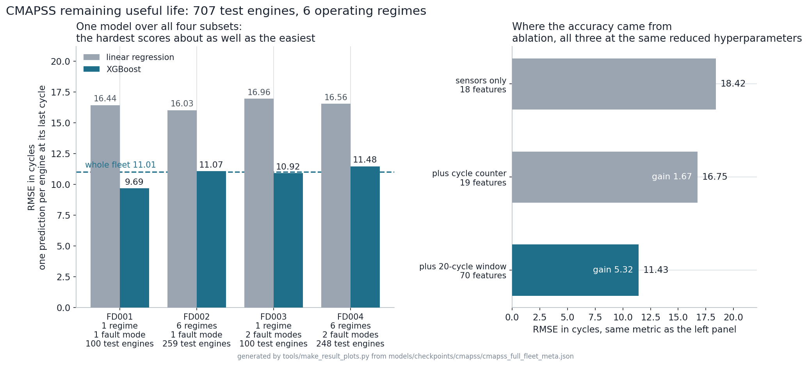

Most published CMAPSS work reports FD001, the easiest subset: one operating
condition, one fault mode. This is one model over all four. The left panel is
the point - FD004, with six regimes and two fault modes, costs about 1.8 cycles
against FD001 rather than needing a model of its own. The right panel says where
the accuracy came from: the raw sensors reach 18.42, and a 20-cycle rolling
window over each of them is worth 5.32 of the 7 cycles gained. The feature set
did the work, not the algorithm.

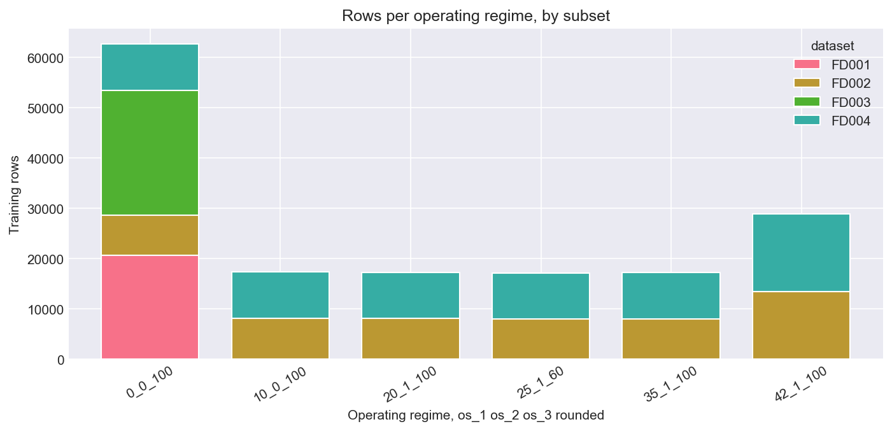

What a mixed fleet means in rows. FD001 and FD003 fly one operating regime and
land entirely in the first bar; FD002 and FD004 spread across all six. A model
trained on FD001 has never seen five of them, which is why that pipeline's own
rules did not survive the move: it dropped seven sensors as flat, and only four
are constant inside every regime. The figure comes from
`notebooks/01_timeseries/01_cmapss_eda.ipynb`, which runs on all four subsets.

### Fault classification: the threshold decided it, the structure did not

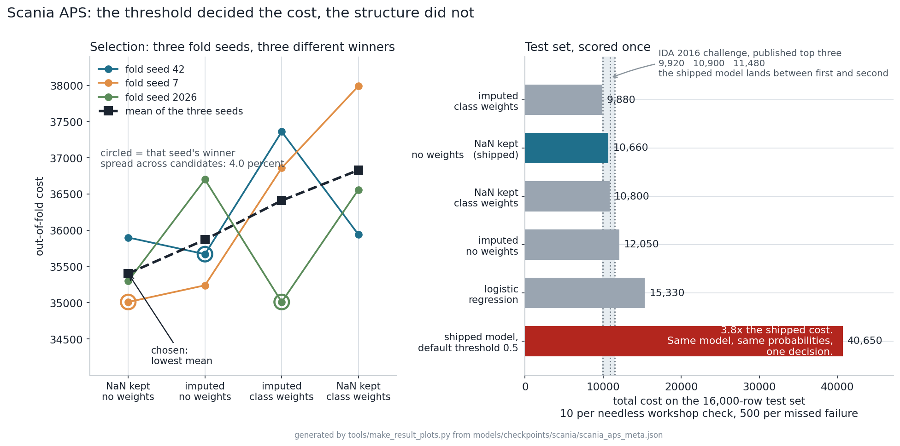

The left panel is the finding. Three fold seeds rank the same four candidates
three different ways, a spread of 4.0 percent, so any single one of them reported
as a result would have been a coin flip. The choice is the lowest **mean**
out-of-fold cost, and the test set is scored once. That protocol costs something
and the cost is recorded: the configuration scoring best on test, 9,880, is not
the one that won out-of-fold, and the 780 between them is the price of not
choosing on the test set.

The right panel is what one decision was worth. The same model and the same
probabilities, read at the default threshold 0.5, cost 40,650 against 10,660 - a
factor of 3.8, and invisible to accuracy, which is above 99 percent either way.

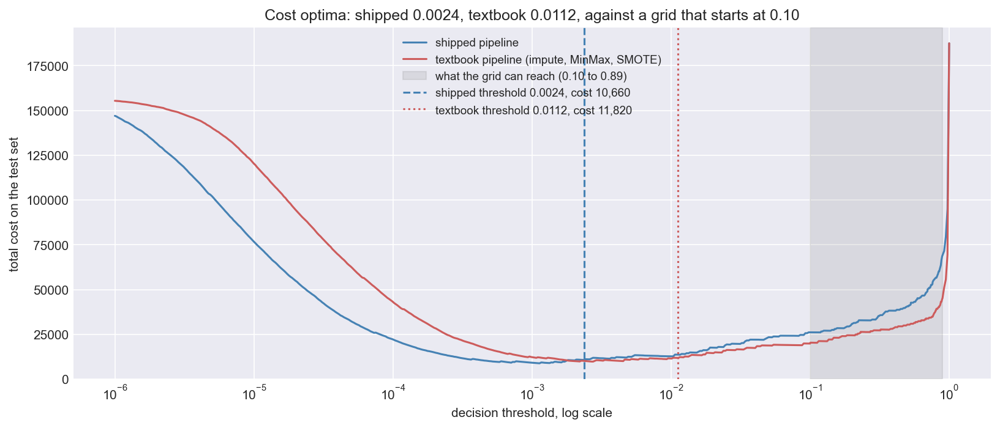

The standard recipe for an imbalanced tabular problem is to impute the missing
values, scale them, resample the classes with SMOTE and read the threshold off a
grid. Measured against the shipped pipeline on the same test set with the same
hyperparameters, it costs **11,820 against 10,660** - an imputer, a scaler and
58,000 synthetic training rows for a result worse than leaving the data alone.

The grey band is the second finding, and it is not the obvious one. It marks what
a threshold grid running from 0.10 can reach, and **both curves bottom out to the
left of it.** Resampling does move the operating point up, from 0.0024 to 0.0112,
but that is a factor of 4.7 where reaching the grid's floor would take 42. So the
grid is pinned at its own lowest step and costs 19,830. On this dataset the
threshold is the whole model, and a grid that starts at 0.10 cannot express it
under either pipeline.

This figure is drawn by `notebooks/02_ml/03_scania_modeling.ipynb`, which
reproduces the deployed model and then measures the alternative beside it. The one
above it is drawn by `tools/make_result_plots.py` from the metrics file alone, so
it rebuilds without the dataset.

### Visual inspection: an operating point, not an accuracy

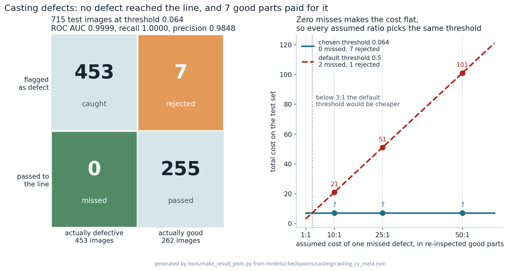

No defect reached the line, and 7 of 262 good parts were re-inspected for it.
The dataset ships no cost metric, so the ratio of a missed defect to a
re-inspected good part is an Arkon assumption - which is what makes the right
panel the honest half. With zero misses the cost does not depend on that
assumption at all, so 10:1, 25:1 and 50:1 select the same threshold; only below
about 3:1 would the default 0.5 be cheaper. The assumption is stated, and then
shown not to matter.

### The same module, checked rather than trusted

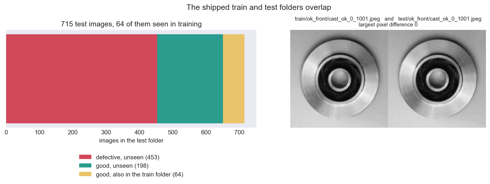

Rebuilding this module as notebooks turned up something the training script never
checked: **the published train and test folders are not disjoint.** 64 of the 715
test images are byte-identical copies of images in the train folder, 55 of them on
the training side of the split and therefore fitted on.

The leak is one-sided, which is what makes it worth stating precisely rather than
either hiding or overstating. Every one of the 64 is a good part and not one is a
defect, so the recall claim above is measured on defects the model has never seen
and is untouched. The false-alarm count is not: scoring the same predictions over
only the 198 good parts that appear nowhere in the train folder gives 6 rejected
rather than 7, 3.03 per cent against 2.67.

**And the operating point is not reproducible.** Three runs of the identical
experiment from the identical seed put the threshold between 0.0436 and 0.2203 and
the missed defects between 0 and 2, while the frozen-backbone ablation came back
bit-identical every time. That pair locates the movement in the convolution
backward pass rather than in the code, and it reaches the decision because the
scores pile up at both ends with only 25 of 715 anywhere between, leaving the cost
curve no well-determined minimum to find. `docs/Model_Card_Casting_CV.md` carries
the four-run table.

### Defect types on steel: a perfect score, and why that is the wrong headline

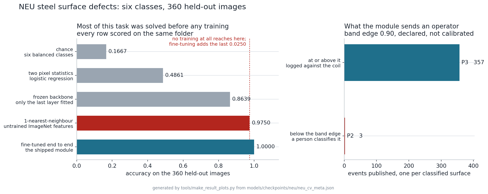

The fourth module names which of six defect types is on a hot-rolled steel
surface, and it gets all 360 held-out images right. **The left panel is why that
number is reported with a qualification attached.** A 1-nearest-neighbour
classifier over ImageNet features that were never trained on steel already reaches
0.9750 on the same folder. Fine-tuning adds the last 0.0250. NEU-DET six-class
classification is close to saturated, so a perfect score is evidence about the
benchmark before it is evidence about the model.

The dataset ships no test folder, only `train/` and `validation/`. This module
therefore splits the train folder for its own model selection and holds the shipped
`validation/` folder back entirely, scoring it once, and every number above says
which folder produced it. The split was checked for the leak casting turned out to
have: no image crosses it on file bytes, on decoded pixels, or on feature
similarity, and the control settles it, since a test image sits as close to the
rest of the test folder as it does to the training set.

Two things the notebooks found that the score does not show. **6.8 per cent of the
images carry a second defect class that the folder label discards** - scratches
with inclusion, pitted surface with patches - so a single-label classifier cannot
be right about both, and that is a ceiling on any model of this shape. And **the
confidence band could not be calibrated at all**: the intended rule was the lowest
confidence at which the accepted predictions are right 99 per cent of the time, but
the model classified all 216 selection images correctly, so every threshold met the
target and the rule returned zero. The band edge in the right panel is declared as
an Arkon assumption, the way casting's cost ratios are, and
`docs/Model_Card_NEU_Surface.md` says so rather than presenting it as measured.

### Component anomalies: four detectors, and nothing trained

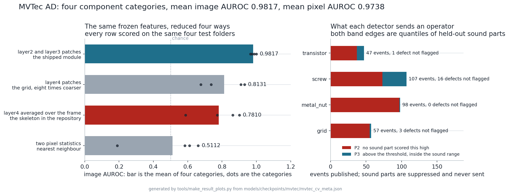

The fifth module is the first that does not classify anything and the first that
**trains nothing at all**. It holds 56,960 feature vectors taken from sound
parts, 87.4 MB for four component categories, and scores a new part by
how far its worst patch sits from the nearest one. There is no loss, no epoch and
no gradient anywhere in it.

Mean image AUROC 0.9817 and mean pixel
AUROC 0.9738, but **the four rows are
the result and the mean is not**: they run from 0.9650 in
screw to 1.0000 in metal_nut. The four categories were
photographed at two resolutions in two colour modes with frame intensities from
59 to 184, so they are four imaging setups rather than four views of one problem,
and each gets its own memory bank and its own threshold.

**The left panel is the reason the design is what it is.** The notebook folder
shipped a skeleton that averaged `layer4` over the whole frame; on the same
frozen features and the same folders it reaches 0.7810
against 0.9817 for the shipped module. Notebook
02 predicted that from the masks alone before either was run: the median `screw`
defect covers 0.29 per cent of its frame, so averaging the frame gives it one
part in 347 of the vector that decides the score.

**The threshold is the casting lesson applied.** Casting searched a cost curve
for an optimum and the optimum moved by a factor of five between runs of
identical code. This module never searches: the threshold is the lowest score
that flags no more than 5 per cent of held-out *sound* parts, so no defect is
involved in setting it and there is no minimum for noise to relocate. Run twice
from the same seed, the memory banks come back bit-identical, no test score moves
at all, no decision changes, and the four thresholds shift in their fifth decimal
against a casting operating point that spans 0.0436 to 0.2203.

**Two things the module publishes and one it refuses to.** It publishes a score
and, because the per-cell distances are computed on the way to it, a region: the
pixel maps are scored against the shipped masks. It refuses to publish a
severity. Fitted only on sound parts, it has no basis for calling a scratch worse
than a bent lead, so there is no P1 band and the priority says only whether a
sound part has ever scored this high. 309 of 453 test images
produce an event and 144 are suppressed as sound.

**And the honest caveat is about the benchmark, not the module.** MVTec AD ships
no anomalous validation data at all: sound parts for fitting, mixed parts for
reporting, nothing in between. Any choice that reasons about defect size or
resolution reasons from the folder the module is scored on. The threshold and the
memory-bank size are the two decisions made on sound parts alone, and
`docs/Model_Card_MVTec_Anomaly.md` says which the others are.

### Where on the part, and it costs nothing extra

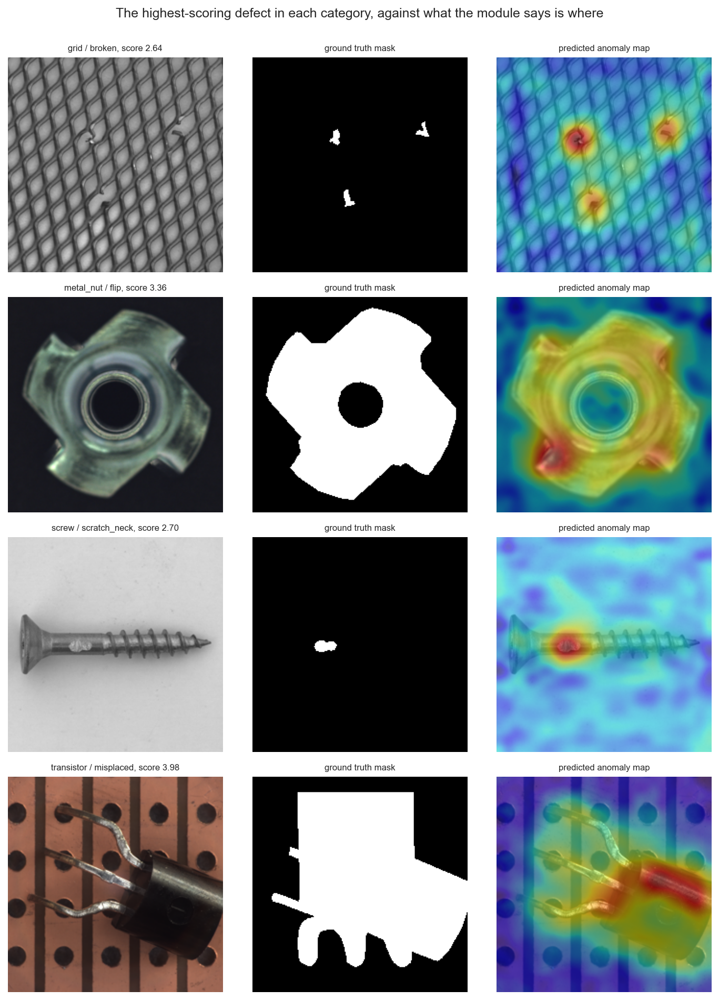

The per-cell distances are computed on the way to the image score, so the map on
the right is a by-product rather than a second model. It is also what an operator
actually receives, because a label is the one thing this module does not have: not
*what* is wrong, but *where* to look.

**The four rows are the two ends of this dataset.** `screw` carries the smallest
defects in the set, a median 0.29 per cent of the frame, and the map puts a single
spot on the scratch. The three breaks in the `grid` are found separately rather
than smeared into one. And the flipped nut and the misplaced transistor light up
almost whole, because in those two defect types nothing is damaged at all: an
intact part is in the wrong orientation, so the part is the anomaly. One threshold
ranks both ends.

**The metric flatters, which is part of why the map is here.** Defect pixels are
0.250 to 11.719 per cent of the total, so a map that is roughly right everywhere
already scores well; pixel AUROC runs 0.9322 in transistor to 0.9948 in screw and
says less than the picture does. It is measured at 320 by 320 over every pixel of
every test image, sound ones included, so it is not comparable with published
MVTec figures at native resolution.

**What these figures are not.** All five are held-out test splits of public
datasets, scored offline. Nothing here ran on a real production line, and the
operational context around the numbers is fabricated. Each module's limitations
are in its model card - [CMAPSS](docs/Model_Card_CMAPSS_RUL.md),
[Scania](docs/Model_Card_Scania_APS.md), [casting](docs/Model_Card_Casting_CV.md),
[NEU](docs/Model_Card_NEU_Surface.md), [MVTec](docs/Model_Card_MVTec_Anomaly.md) - and are not summarised away here.

---

## Architecture

```
Arkon Manufacturing AI Platform
│
├── ⏱️  Time Series      Engine Testing Dept.   NASA CMAPSS       RUL Prediction
├── 🔧  ML Classification Truck Fleet Dept.      Scania APS        Fault Detection
├── 🔍  CV Binary         Foundry Dept.          Casting Product   Defect Detection
├── 🔬  CV Multi-class    Rolling Mill Dept.     NEU Surface       Defect Type
├── 🧭  CV Anomaly        Component Inspection   MVTec AD          Anomaly + Region
├── 🤖  LLM / RAG         All Departments        -                 AI Chatbot
└── 📊  BI Dashboard      Executive Level        Tableau           KPI Analytics
```

### Runtime wiring, as deployed 2026-08-31

The map above is the capability plan. This is what actually runs, and how the
pieces reach each other. Two things enter the system from outside - a batch of
risk events scored on the laptop, and an operator asking a question - and both
land on the NAS, which owns every store.

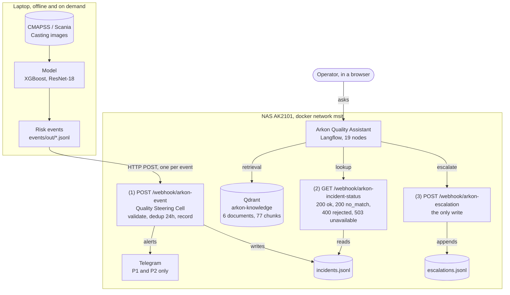

The assistant reaches the incident store only through endpoint 2, so it cannot
invent a status: it has no other source. Inside the canvas, one classification
picks one branch and the rest are deactivated.

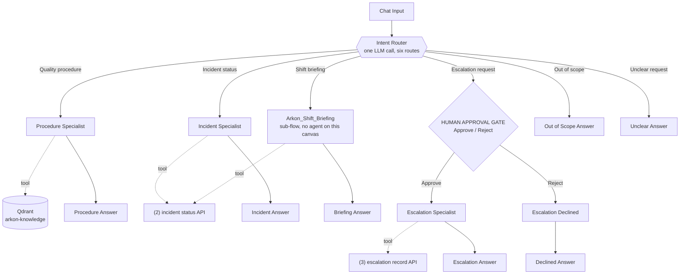

**The last two routes carry a fixed message on the router itself**, so each
reaches its output with no agent in between and no second model call. They are
two routes rather than one because the operator is owed the right reason: out of
scope means the subject is not covered, unclear means it is Arkon work with a
piece missing, and answering the second as the first teaches people to stop
asking.

**The briefing has its own branch for a different reason.** Reaching it as a
tool of the incident specialist put a fixed four-block format inside an agent
whose job is to answer in its own words: the operator got the briefing twice,
and the paraphrase relabelled an incident's age as an overdue figure. A
component whose value is its exact output must not be reached through something
that rewords.

**Where the two systems meet is one file and three URLs.** n8n owns the incident
store; Langflow never touches it. The assistant only ever sees what an endpoint
chooses to return, which is why the store can change shape without touching the
canvas, and why the assistant cannot invent a status: it has no other source.

**Two host settings make the arrows work**, and neither is obvious from an error
message. n8n carries the Docker network alias `n8n.arkon.internal`, because
Langflow's API Request component validates URLs with `validators.url()` and
rejects any hostname without a dot. And Langflow runs with
`LANGFLOW_SSRF_ALLOWED_HOSTS=n8n.arkon.internal`, because it blocks outbound
calls into private IP ranges by default. Details in `n8n/README.md` and
`langflow/README.md`.

**Direction of trust.** Everything the assistant can change goes through
endpoint 3, and endpoint 3 is reachable only from the Approve branch of the
human gate. Telegram is wired to endpoint 1 only, so no message reaches a person
because of anything the assistant did.

---

## Datasets

| Module | Dataset | Source | License | Size | Task |
|--------|---------|--------|---------|------|------|
| Time Series | [NASA CMAPSS Turbofan Engine Degradation](https://www.kaggle.com/datasets/behrad3d/nasa-cmaps) | NASA Prognostics CoE / Kaggle mirror | CC0 1.0 | ~3 MB | RUL regression |
| ML | [APS Failure at Scania Trucks](https://archive.ics.uci.edu/dataset/421/aps+failure+at+scania+trucks) | Scania CV AB via UCI ML Repository | CC BY 4.0 | ~54 MB | Binary classification |
| CV | [Casting Product Quality Control](https://www.kaggle.com/datasets/ravirajsinh45/real-life-industrial-dataset-of-casting-product) | Kaggle | CC BY-NC 4.0 | ~100 MB | Binary image classification |
| CV | [NEU-DET Surface Defect Database](http://faculty.neu.edu.cn/songkechen/zh_CN/zdylm/263270/list/index.htm) | Northeastern University, China | Academic use | ~35 MB | 6-class classification (ships detection boxes too) |
| CV | [MVTec Anomaly Detection](https://www.mvtec.com/company/research/datasets/mvtec-ad) | MVTec Software GmbH | Research only | ~4.9 GB | Anomaly detection (4 of 15 categories used) |
| CV (planned) | [GC10-DET Surface Defects](https://github.com/lvxiaoming2019/GC10-DET-Metallic-Surface-Defect-Datasets) | Academic | Academic use | ~1 GB | Object detection |

> **Note:** NASA CMAPSS is a physics-based simulation (not raw sensor data),
> but is the gold-standard benchmark for RUL prediction research.
> Always verify dataset licenses before commercial use.

---

## What's Built

- [x] Project structure & environment setup
- [x] Dataset downloads (all 7 datasets)
- [x] Project Charter - risk events, P1-P4 priorities, steering-cell rules (`docs/Project_Charter.md`)
- [x] Time Series module, first pass - CMAPSS on FD001 alone, one subset of four (LR RMSE 20.79, XGBoost RMSE 17.11). Superseded by the full-fleet model below; its metrics are kept at `models/checkpoints/cmapss/cmapss_xgb_v1_meta.json` and the notebooks that produced it were rebuilt on the fleet on 2026-08-31
- [x] Time Series module, full fleet - all four CMAPSS subsets, 709 training engines, six operating regimes, two fault modes, with temporal features over a 20-cycle window. XGBoost RMSE 11.01 on the benchmark task over 707 held-out engines, scoring the hardest subset about as well as the easiest (`notebooks/01_timeseries/cmapss_full_fleet.py`, `docs/Model_Card_CMAPSS_RUL.md`). Also built as a notebook trio that reproduces the deployed model without importing from the training script: nine measurements compared, none moved
- [x] Risk-event layer - schema, validator and five adapters, one per built module, all publishing the same contract (`events/`)
- [x] n8n Quality Steering Cell - deployed on the NAS and verified end to end: contract validation, 24 h duplicate suppression, JSONL incident store, Telegram cards for P1 and P2 (`n8n/`)
- [x] Operating documentation - CMAPSS model card and Steering Cell SOP (`docs/`)
- [x] **Tabular module - Scania APS fault classifier.** XGBoost over 170 anonymised counters, total cost 10,660 on the dataset's own metric of 10 per needless workshop check and 500 per missed failure, which lands between first and second of the IDA 2016 challenge's published top three on the same test set. The decision threshold is worth a factor of 3.8; every structural choice is inside the noise of the selection (`notebooks/02_ml/scania_aps.py`, `docs/Model_Card_Scania_APS.md`). Rebuilt as a notebook pair on 2026-09-01, which reproduces the deployed model exactly - 22 measurements compared, none moved - and adds the one measurement the script never ran: the textbook pipeline of median imputation, MinMax scaling and SMOTE costs 11,820 against 10,660, and the threshold grid it uses starts above the optimum of both pipelines
- [x] **CV module - casting defect inspection.** ResNet-18 fine-tuned end to end, 0 defects missed and 7 good parts rejected on 715 test images, ROC AUC 0.9999. Its priority bands run the opposite way to the other modules, and the reason is measured (`notebooks/03_cv/01_casting_defects/casting_cv.py`, `docs/Model_Card_Casting_CV.md`). Rebuilt as a notebook trio on 2026-09-01, which found two things the script never checked. **The published train and test folders share 64 byte-identical images, all of them good parts**, 55 of which were fitted on: recall is untouched because no defect is duplicated, and the false-alarm rate on genuinely unseen good parts is 3.03 percent against the 2.67 percent reported. **And the experiment does not reproduce itself** - four runs from the same seed on the same machine put the operating point anywhere from 0.0436 to 0.2203, the missed defects from 0 to 2 and the good parts rejected from 2 to 11, while the frozen-backbone ablation, which trains no convolution, comes back bit-identical every time. The instability is cuDNN's convolution backward pass reaching a decision threshold that is chosen on a cost curve with no well-determined minimum
- [x] **CV module - NEU steel surface defect types.** ResNet-18 fine-tuned end to end over six defect classes, built from scratch as a notebook trio on 2026-09-01 with no training script behind it (`notebooks/03_cv/02_neu_steel_defects/`, `docs/Model_Card_NEU_Surface.md`). **1.0000 accuracy on 360 held-out images, and the notebook is what qualifies it**: a 1-nearest-neighbour classifier over un-finetuned ImageNet features already reaches 0.9750 on the same folder, so the benchmark is close to saturated and a perfect score is evidence about the dataset before it is evidence about the model. The dataset ships no test folder, so the shipped `validation/` folder is held out and scored once, and every number says which folder produced it. Two further findings: **6.8 per cent of the images carry a second defect class the folder label discards**, which is a ceiling on any single-label model, and **the confidence band could not be calibrated at all** because the model classified all 216 selection images correctly, so its band edge is declared as an Arkon assumption rather than measured. Unlike casting the split is clean - no image crosses it on either byte equality or feature similarity, with the control measured
- [x] **CV module - MVTec component anomaly detection.** Four detectors, one per
component category, built from scratch as a notebook trio on 2026-09-01 with no
training script behind it (`notebooks/03_cv/03_mvtec_anomaly/`,
`docs/Model_Card_MVTec_Anomaly.md`). **Nothing is trained**: a frozen ImageNet
ResNet-18, a greedy coreset of 56,960 patch vectors taken from sound parts only,
and a nearest-neighbour distance. Mean image AUROC
0.9817 and mean pixel AUROC
0.9738, spanning
0.9650 in screw to 1.0000 in
metal_nut, and the four numbers are reported as four results because the categories
are four imaging setups. Three findings. **The skeleton design that shipped in the
folder reaches 0.7810 against
0.9817**, and notebook 02 predicted that from the
mask geometry before either was run. **The threshold is declared on sound parts
rather than searched on scores**, which is the casting lesson applied: run twice
from one seed the banks come back bit-identical, no test score moves and no
decision changes, with the four thresholds shifting only in their fifth decimal,
because there is no backward pass for the non-determinism to enter through. And
**the benchmark ships no anomalous validation data**, so every design choice that
reasons about defects reasons from the folder the module is scored on; the
threshold and the memory-bank size are the two that escaped that, and the card
names the rest
- [x] **Read and write endpoints** - `GET /webhook/arkon-incident-status` over the incident store, and `POST /webhook/arkon-escalation`, the first audited write (`n8n/README.md`)
- [x] **Grounded assistant - the Arkon Quality Assistant on Langflow.** Nineteen nodes, six routes, retrieval over a Qdrant store of eight Arkon documents, a live incident lookup, a human approval gate in front of the one write, and a shift-briefing sub-flow. It closes the last open MVP criterion of charter section 10, an operational interface (`langflow/README.md`)
- [ ] NLP module - NHTSA complaint classification and field-quality trend detection
- [ ] Incident lifecycle - acknowledge and close callbacks, escalation timer, queryable store
- [ ] Streamlit app and Tableau views - the operational cockpit and the executive KPI view

### One deployed piece that is not an Arkon feature

Seven pieces are deployed: three Langflow flows and four n8n workflows. Six of
them run the plant. The exception is the twelve-node
`n8n/comparison_slice_v1.json`, which exists to test a claim about the platform
rather than to serve an operator, and could be deleted without loss. It is kept
because the claim it settles is documented in `n8n/README.md` and the evidence is
worth more than the twelve nodes cost.

---

## Planned Extensions

| Module | Dataset | Task | Prerequisite |
|--------|---------|------|-------------|
| CV Object Detection | GC10-DET | Bounding box defect localization | YOLO / detection models |
| BI Dashboard | All modules | Executive KPI analytics | Tableau |

---

## Stack

```
Language    Python 3.12
ML          scikit-learn, XGBoost, imbalanced-learn
Time Series statsmodels
CV          PyTorch, torchvision, albumentations, OpenCV
MLOps       MLflow (experiment tracking, model registry)
Assistant   Langflow 1.11.5, Qdrant, OpenRouter (deployed)
Automation  n8n (webhooks, incident store, Telegram)
App         Streamlit (planned)
BI          Tableau (planned)
Utilities   pandas, numpy, matplotlib, seaborn, plotly
```

The `langchain`, `chromadb` and `openai` pins in `requirements.txt` belong to the
planned Streamlit app, not to the deployed assistant: that one runs on Langflow
over Qdrant and reaches n8n over HTTP.

---

## Setup

**Windows (RTX GPU):**
```powershell
cd path\to\arkon-manufacturing-ai
.\setup_windows_venv.bat
python verify_setup.py
python -m ipykernel install --user --name arkon-win --display-name "Arkon AI (Win+CUDA)"
```

**Mac (Apple Silicon):**
```bash
python3.12 -m venv ~/venvs/arkon-manufacturing-ai_mac_venv
source ~/venvs/arkon-manufacturing-ai_mac_venv/bin/activate
pip install torch torchvision torchaudio
pip install -r requirements-windows.txt
python -m ipykernel install --user --name arkon-mac --display-name "Arkon AI (Mac+MPS)"
```

**Run notebooks** - open in VS Code or JupyterLab, select the kernel above,
run in order: `01_eda → 02_preprocessing → 03_modeling` per module.

**Run Streamlit app:**
```bash
streamlit run app/main.py
```

---

## MLflow - Experiment Tracking

All model training runs are logged automatically to a local SQLite database.
No server setup required - just run the modeling notebooks.

**View the MLflow UI:**
```bash
# From the project root (with venv active):
mlflow ui --backend-store-uri sqlite:///mlflow.db
```
Then open **http://localhost:5000** in your browser.

**Experiment structure:**

| Experiment | Module | Runs in `mlflow.db` |
|---|---|---|
| `arkon-timeseries-cmapss` | Engine Testing | baseline_linear_regression, xgboost_full_fleet_notebook x3, xgboost_v1 |
| `arkon-ml-scania` | Truck Fleet | scania_aps_notebook x2 |
| `arkon-cv-casting` | Foundry | casting_cv_notebook x3 |
| `arkon-cv-neu` | Rolling Mill | neu_resnet18_v1 x6 |
| `arkon-cv-mvtec` | Component Inspection | mvtec_patchcore_v1_grid, _metal_nut, _screw, _transistor, _summary |
| `arkon-cv-gc10` | Stamping | not created; the module is not built |

Each run logs: hyperparameters, metrics per epoch, training time, and the metrics file.
The table above is read from `mlflow.db` rather than maintained by hand: an earlier
version of it named runs that no experiment contained and two experiments that had
never been created.

---

## Project Structure

```
arkon-manufacturing-ai/
├── app/                        Streamlit application
│   ├── main.py                 Entry point
│   ├── pages/                  One file per module
│   └── utils/                  Shared utilities
├── assets/                     Saved plots for README and Streamlit
│   ├── timeseries/
│   ├── ml/
│   └── cv/
├── tools/
│   └── make_result_plots.py    Regenerates the result figures from the metrics files
├── data/
│   ├── 01_cmapss/              NASA CMAPSS txt files
│   ├── 02_scania/              Scania APS csv files
│   ├── 03_casting/             Casting Product images
│   ├── 04_neu/                 NEU Steel Defect images
│   ├── 05_mvtec/               MVTec Anomaly Detection images
│   └── 06_gc10/                GC10-DET Steel Defect images
├── models/                     Gitignored except the five *_meta.json metrics files
│   ├── checkpoints/            Training checkpoints (auto-saved, skip retraining)
│   └── *.pkl / *.pt            Final saved models
├── notebooks/
│   ├── utils/arkon_utils.py    Shared utilities (device, MLflow, timer, checkpoint)
│   ├── 01_timeseries/          CMAPSS - RUL prediction
│   ├── 02_ml/                  Scania APS - fault classification
│   └── 03_cv/                  Computer Vision - casting, NEU, MVTec, GC10
├── mlflow.db                   MLflow experiment database
├── setup_windows_venv.bat      Windows venv + CUDA setup
├── requirements-windows.txt    Python dependencies
├── verify_setup.py             Environment verification script
└── .python-version             Python 3.12
```

---

## Author

**Sergey Kasatov** - Data Analyst with 17 years of background in automotive
engineering. This project applies ML, Time Series, and Computer Vision to
industrial manufacturing problems - a domain with direct relevance to
real-world production environments.

---

## License

For portfolio and educational purposes only.
Datasets are subject to their original licenses - see each dataset source.
