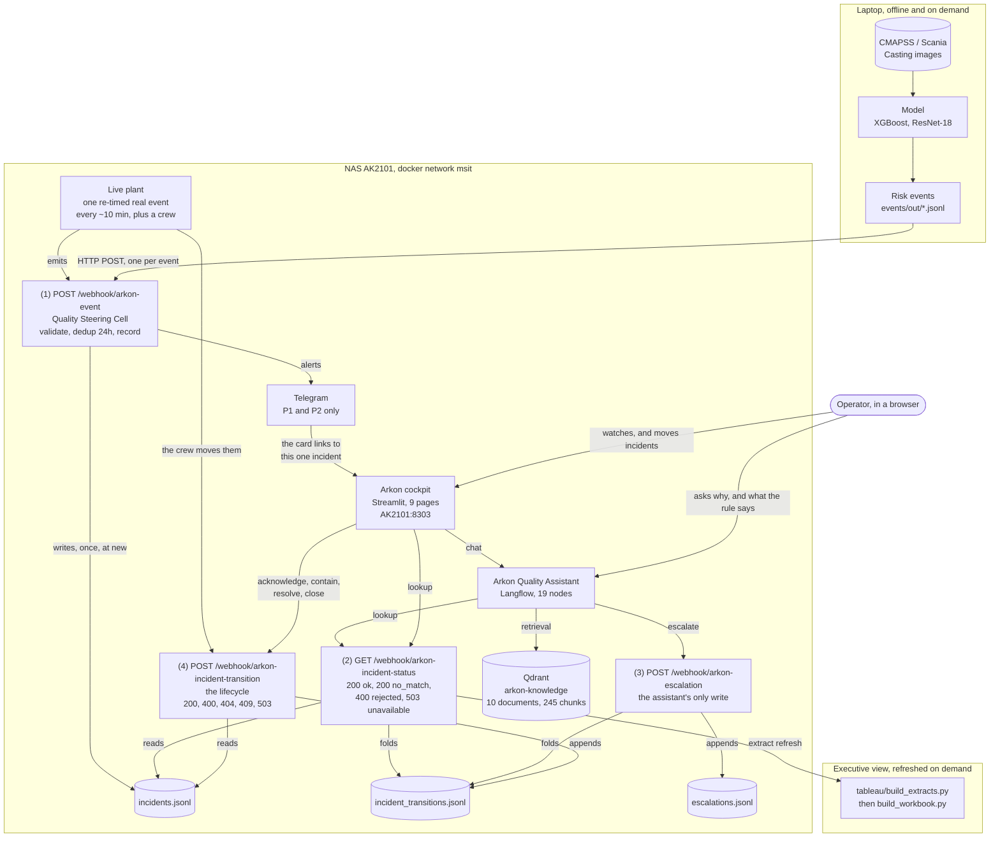
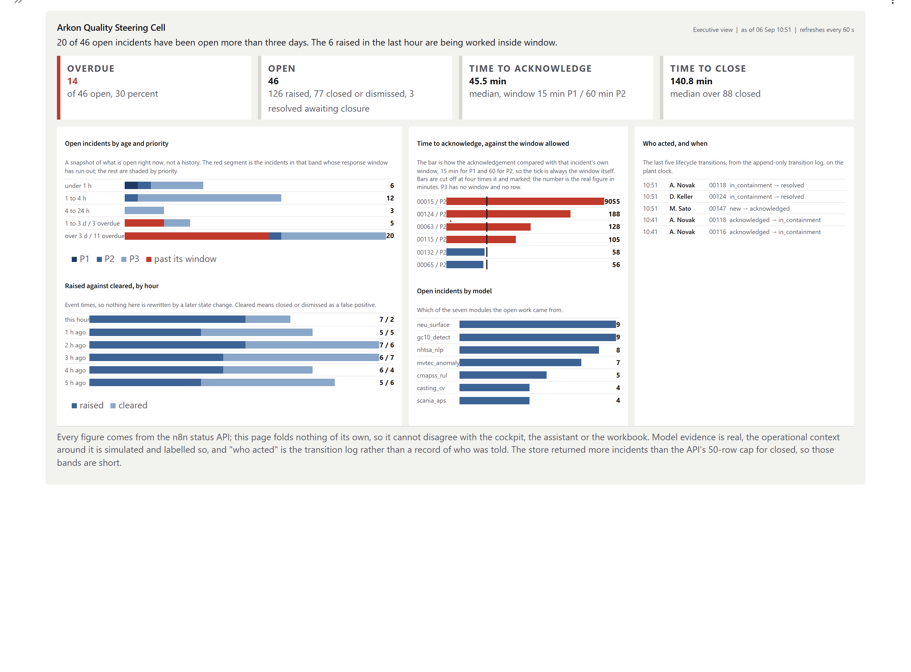
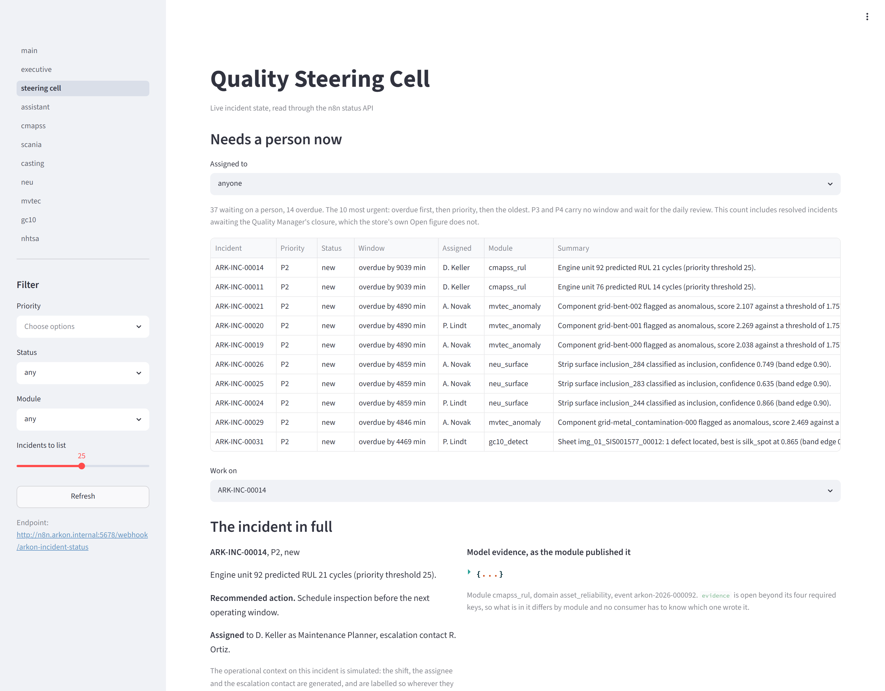
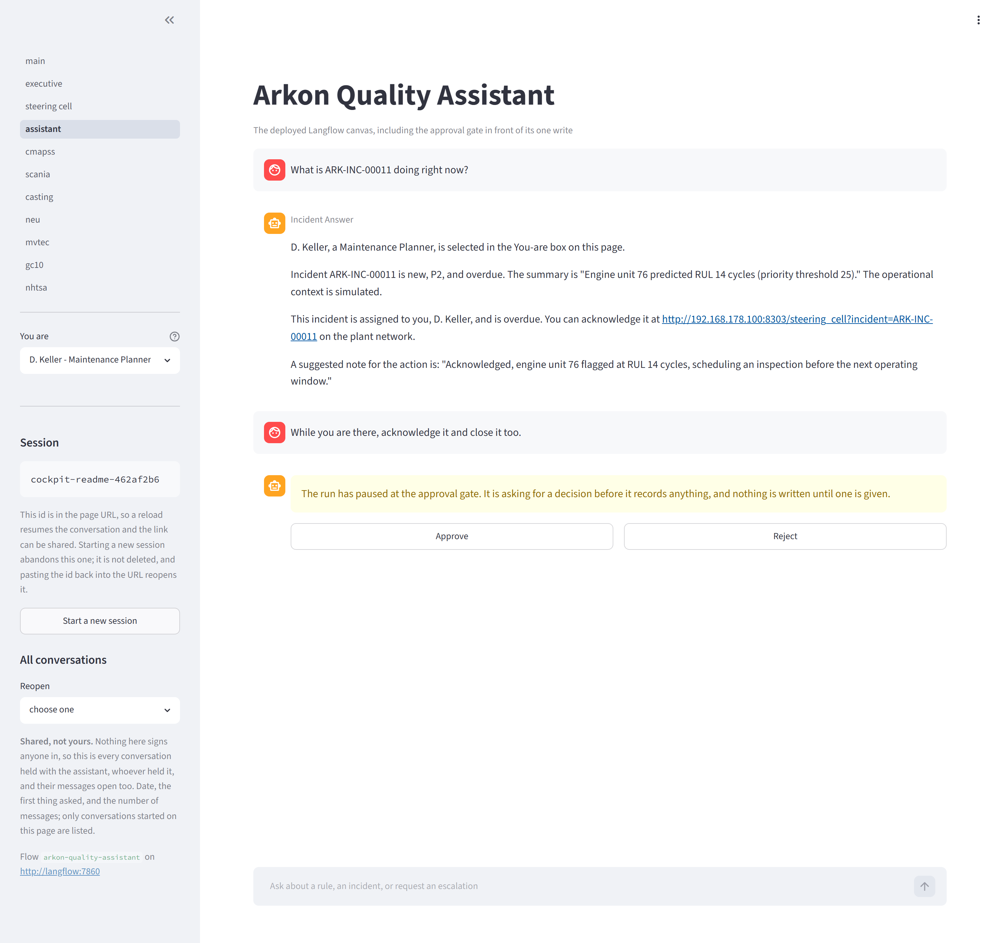
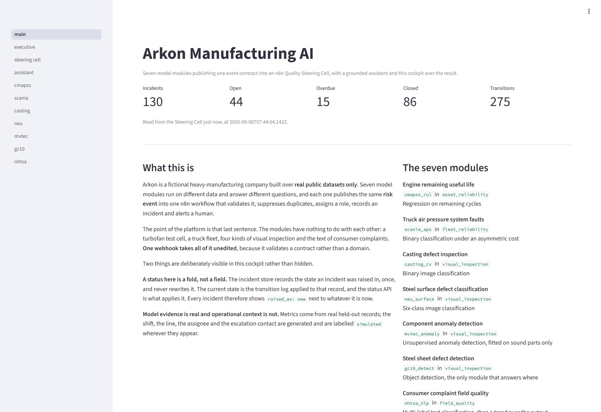
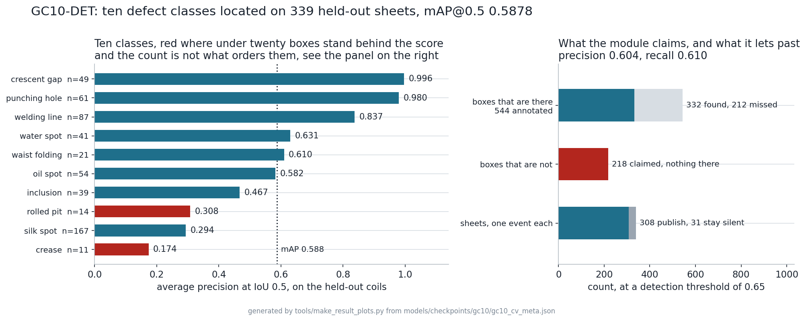
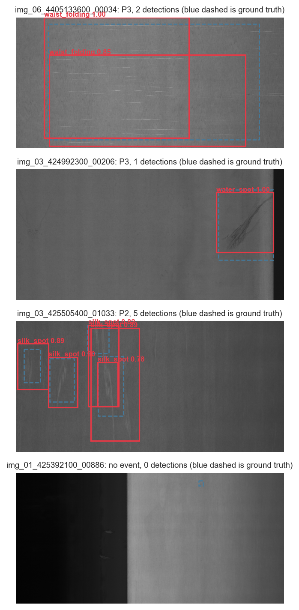
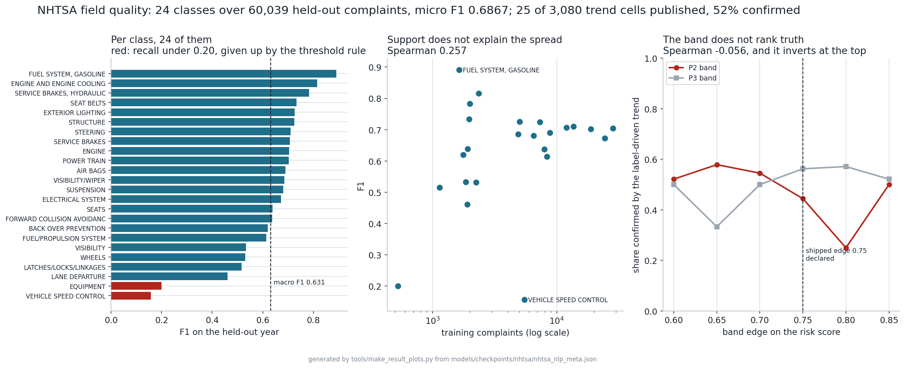

# Arkon Manufacturing AI

> An Industry 4.0 quality platform for a fictional heavy manufacturer. Seven
> machine-learning models on real public datasets publish one event contract; a
> Steering Cell on n8n triages what they raise, assigns it and alerts a named
> person; two operator surfaces and an executive view carry it from there.
> Deployed on a NAS and running.

[](https://github.com/sergey-kasatov/arkon-manufacturing-ai/actions/workflows/tests.yml)

---
## Overview

Arkon Manufacturing AI is a working Industry 4.0 quality platform for a fictional
heavy manufacturer: seven machine-learning modules watching four departments, and
the whole chain that turns what they see into a person doing something about it.

**Seven models, on seven real public datasets.** Predictive maintenance on engines
and truck fleets, visual inspection of castings, steel strip and components, defect
localisation on steel sheet, and a text model over consumer complaints. Each is
trained, measured on held-out data, and shipped with a model card that says what it
cannot do.

**One contract between them and everything downstream.** Every module publishes the
same twelve-field risk event, so nothing after this point knows or cares which model
spoke.

**A Quality Steering Cell that runs, on n8n.** It validates the contract, suppresses
a repeat of the same evidence inside 24 hours, writes the incident to an append-only
store, assigns it by department, and puts a **Telegram card in front of a named person
for a P1 or P2** - with a link that opens that incident on the operator's screen.

**Two operator surfaces.** The **Streamlit cockpit** (`http://AK2101:8303`, nine
pages) is the operational screen and the only thing that writes a lifecycle
transition: a queue of what needs a person now, and a form offering only the moves
the charter allows from the current state. The **Langflow assistant** answers why,
grounded in ten documents and the live store, and hands the operator to the cockpit
with a drafted note rather than acting for them.

**A plant that keeps moving.** A live emitter raises a real re-timed incident every
eight to twelve minutes across all seven modules, and a simulated crew works them, so
the response-time numbers come from real timestamps rather than from a fixture.

**An executive view on top**, as a generated Tableau workbook and, next, a live page
in the cockpit.

What is built, what is not, and what is deliberately not being built is listed under
[What's Built](#whats-built). The runtime wiring, including which surface is allowed
to write what, is under [Architecture](#architecture).

---


## Architecture

The wiring is drawn under [Runtime wiring](#runtime-wiring-as-deployed-2026-09-05)
below, down to the four webhooks and their status codes. Three properties of it are
worth stating before the diagram, because they are what the boxes are arranged to
protect.

Every module publishes the same event and nothing downstream knows which model
spoke. Every status change goes through one endpoint, so the store is an audit trail
rather than a set of rows someone edited. And the assistant deliberately cannot move
an incident: the response-time KPI is measured from that timestamp, and an agent
making it turns a measurement of the plant into a measurement of the agent.

| Capability | Department | Dataset | What it publishes |
|---|---|---|---|
| Time series | Engine testing | NASA CMAPSS | Remaining useful life |
| ML classification | Truck fleet | Scania APS | Component fault |
| CV binary | Foundry | Casting product | Defect present |
| CV multi-class | Rolling mill | NEU surface | Defect type |
| CV anomaly | Component inspection | MVTec AD | Anomaly and its region |
| CV detection | Stamping | GC10-DET | Where the defect is |
| NLP multi-label | Field quality | NHTSA complaints | Component, and whether a rate moved |
| LLM and retrieval | All | - | Answers about the store and the rules |
| BI | Executive | Tableau | The executive view |

### Runtime wiring, as deployed 2026-09-05

The map above is the capability plan. This is what actually runs, and how the
pieces reach each other. Three things put work into the system - a batch of risk
events scored on the laptop, the live plant emitting one re-timed real event
every ten minutes or so on the NAS itself, and an operator asking a question -
and every one of them lands on the NAS, which owns every store.

**The division of labour between the two operator surfaces is the thing to read
off this diagram.** The cockpit is where an incident is moved: it is the only
consumer that writes a transition, and it writes nothing else. The assistant
never touches the store; it reads through the same status endpoint the screens
read, answers from the ten documents in Qdrant, and holds exactly one write of
its own, the escalation record, behind a human approval gate. So the cockpit
answers what and who, the assistant answers why and what the rule says, and
neither can contradict the other about a status because neither computes one.

**The assistant hands the operator to the cockpit rather than acting for them,
and that boundary was decided rather than inherited (2026-09-05).** The obvious
next feature is to let the assistant acknowledge and close, and it is declined
for a reason that is a measurement rather than a preference: an acknowledgement
is the claim that a named person has seen an incident and taken it, and the
response-time KPI this platform puts in red is measured from that timestamp. An
agent that acknowledges turns a median response time into a measurement of the
agent, and the number survives while its meaning does not, which is the failure
mode this project keeps naming. The quality-management reading is the same one:
a nonconformance disposition has a human owner, and an agent closing one is what
an IATF audit writes up. There is a build cost as well, recorded in
`langflow/README.md`: a canvas holding a Human Input node cannot be run through
`/api/v1/run` at all, so a second gated write breaks every existing v1 caller.

So the assistant does the half it is good at and stops there. It answers what the
rule says and what the model can and cannot claim, then hands over **the link
that opens that incident on the cockpit and a drafted note for the transition
form**. The operator arrives with the form already filled and puts their own name
on it. The agent prepares the decision; the person signs it, and the timestamp
still measures the plant.



The assistant reaches the incident store only through endpoint 2, so it cannot
invent a status: it has no other source. Inside the canvas, one classification
picks one branch and the rest are deactivated.


**The last two routes carry a fixed message on the router itself**, so each
reaches its output with no agent in between and no second model call. They are
two routes rather than one because the operator is owed the right reason: out of
scope means the subject is not covered, unclear means it is Arkon work with a
piece missing, and answering the second as the first teaches people to stop
asking.

**The briefing has its own branch for a different reason.** Reaching it as a
tool of the incident specialist put a fixed four-block format inside an agent
whose job is to answer in its own words: the operator got the briefing twice,
and the paraphrase relabelled an incident's age as an overdue figure. A
component whose value is its exact output must not be reached through something
that rewords.

**Where the two systems meet is one file and three URLs.** n8n owns the incident
store; Langflow never touches it. The assistant only ever sees what an endpoint
chooses to return, which is why the store can change shape without touching the
canvas, and why the assistant cannot invent a status: it has no other source.

**Two host settings make the arrows work**, and neither is obvious from an error
message. n8n carries the Docker network alias `n8n.arkon.internal`, because
Langflow's API Request component validates URLs with `validators.url()` and
rejects any hostname without a dot. And Langflow runs with
`LANGFLOW_SSRF_ALLOWED_HOSTS=n8n.arkon.internal`, because it blocks outbound
calls into private IP ranges by default. Details in `n8n/README.md` and
`langflow/README.md`.

**Direction of trust.** Everything the assistant can change goes through
endpoint 3, and endpoint 3 is reachable only from the Approve branch of the
human gate. Telegram is wired to endpoint 1 only, so no message reaches a person
because of anything the assistant did.

---


## What it looks like running

Photographs of the deployment, not mockups. `py tools/make_ui_screenshots.py`
regenerates them from the running cockpit, waiting for real content on each page
rather than for a timer, so a page that fails to render produces an error and no
picture. The numbers differ between runs because the plant keeps raising incidents.

**The executive view.** One question in five seconds: is the Steering Cell keeping
up, and where is it behind. The sentence under the title is generated from the store,
red appears only where a response window has run out, and the hourly chart is the one
view built from event times rather than current state - so nothing in it is rewritten
by a later status change. Design and its sources: `tableau/Dashboard_Design_v3.md`.



**The Steering Cell, where an operator works.** The queue of what needs a person now,
ordered overdue first, then the incident in full with the model's own evidence, then
"Move this incident" offering only the moves the charter allows from its current
state. This is the only surface in the platform that writes a lifecycle transition,
and the link on a Telegram card opens it on the incident the card announced.



**The assistant, which explains rather than acts.** Six routes over ten documents in
Qdrant and the live incident API, with a human approval gate in front of its single
write. Asked about a named open incident it answers, then hands over: the link that
opens that incident on the page above, and a drafted note for the transition form.



**The cockpit's entry page**, with the live pulse and one page per module.



---


## What's Built

- [x] Project structure & environment setup
- [x] Dataset downloads (all 7 datasets)
- [x] Project Charter - risk events, P1-P4 priorities, steering-cell rules (`docs/Project_Charter.md`)
- [x] Time Series module, first pass - CMAPSS on FD001 alone, one subset of four (LR RMSE 20.79, XGBoost RMSE 17.11). Superseded by the full-fleet model below; its metrics are kept at `models/checkpoints/cmapss/cmapss_xgb_v1_meta.json` and the notebooks that produced it were rebuilt on the fleet on 2026-08-31
- [x] Time Series module, full fleet - all four CMAPSS subsets, 709 training engines, six operating regimes, two fault modes, with temporal features over a 20-cycle window. XGBoost RMSE 11.01 on the benchmark task over 707 held-out engines, scoring the hardest subset about as well as the easiest (`notebooks/01_timeseries/cmapss_full_fleet.py`, `docs/Model_Card_CMAPSS_RUL.md`). Also built as a notebook trio that reproduces the deployed model without importing from the training script: nine measurements compared, none moved
- [x] Risk-event layer - schema, validator and six adapters, one per built module, all publishing the same contract (`events/`)
- [x] n8n Quality Steering Cell - deployed on the NAS and verified end to end: contract validation, 24 h duplicate suppression, JSONL incident store, Telegram cards for P1 and P2 (`n8n/`)
- [x] Operating documentation - CMAPSS model card and Steering Cell SOP (`docs/`)
- [x] **Tabular module - Scania APS fault classifier.** XGBoost over 170 anonymised counters, total cost 10,660 on the dataset's own metric of 10 per needless workshop check and 500 per missed failure, which lands between first and second of the IDA 2016 challenge's published top three on the same test set. The decision threshold is worth a factor of 3.8; every structural choice is inside the noise of the selection (`notebooks/02_ml/scania_aps.py`, `docs/Model_Card_Scania_APS.md`). Rebuilt as a notebook pair on 2026-09-01, which reproduces the deployed model exactly - 22 measurements compared, none moved - and adds the one measurement the script never ran: the textbook pipeline of median imputation, MinMax scaling and SMOTE costs 11,820 against 10,660, and the threshold grid it uses starts above the optimum of both pipelines
- [x] **CV module - casting defect inspection.** ResNet-18 fine-tuned end to end, 0 defects missed and 7 good parts rejected on 715 test images, ROC AUC 0.9999. Its priority bands run the opposite way to the other modules, and the reason is measured (`notebooks/03_cv/01_casting_defects/casting_cv.py`, `docs/Model_Card_Casting_CV.md`). Rebuilt as a notebook trio on 2026-09-01, which found two things the script never checked. **The published train and test folders share 64 byte-identical images, all of them good parts**, 55 of which were fitted on: recall is untouched because no defect is duplicated, and the false-alarm rate on genuinely unseen good parts is 3.03 percent against the 2.67 percent reported. **And the experiment does not reproduce itself** - four runs from the same seed on the same machine put the operating point anywhere from 0.0436 to 0.2203, the missed defects from 0 to 2 and the good parts rejected from 2 to 11, while the frozen-backbone ablation, which trains no convolution, comes back bit-identical every time. The instability is cuDNN's convolution backward pass reaching a decision threshold that is chosen on a cost curve with no well-determined minimum
- [x] **CV module - NEU steel surface defect types.** ResNet-18 fine-tuned end to end over six defect classes, built from scratch as a notebook trio on 2026-09-01 with no training script behind it (`notebooks/03_cv/02_neu_steel_defects/`, `docs/Model_Card_NEU_Surface.md`). **1.0000 accuracy on 360 held-out images, and the notebook is what qualifies it**: a 1-nearest-neighbour classifier over un-finetuned ImageNet features already reaches 0.9750 on the same folder, so the benchmark is close to saturated and a perfect score is evidence about the dataset before it is evidence about the model. The dataset ships no test folder, so the shipped `validation/` folder is held out and scored once, and every number says which folder produced it. Two further findings: **6.8 per cent of the images carry a second defect class the folder label discards**, which is a ceiling on any single-label model, and **the confidence band could not be calibrated at all** because the model classified all 216 selection images correctly, so its band edge is declared as an Arkon assumption rather than measured. Unlike casting the split is clean - no image crosses it on either byte equality or feature similarity, with the control measured
- [x] **CV module - MVTec component anomaly detection.** Four detectors, one per
component category, built from scratch as a notebook trio on 2026-09-01 with no
training script behind it (`notebooks/03_cv/03_mvtec_anomaly/`,
`docs/Model_Card_MVTec_Anomaly.md`). **Nothing is trained**: a frozen ImageNet
ResNet-18, a greedy coreset of 56,960 patch vectors taken from sound parts only,
and a nearest-neighbour distance. Mean image AUROC
0.9817 and mean pixel AUROC
0.9738, spanning
0.9650 in screw to 1.0000 in
metal_nut, and the four numbers are reported as four results because the categories
are four imaging setups. Three findings. **The skeleton design that shipped in the
folder reaches 0.7810 against
0.9817**, and notebook 02 predicted that from the
mask geometry before either was run. **The threshold is declared on sound parts
rather than searched on scores**, which is the casting lesson applied: run twice
from one seed the banks come back bit-identical, no test score moves and no
decision changes, with the four thresholds shifting only in their fifth decimal,
because there is no backward pass for the non-determinism to enter through. And
**the benchmark ships no anomalous validation data**, so every design choice that
reasons about defects reasons from the folder the module is scored on; the
threshold and the memory-bank size are the two that escaped that, and the card
names the rest
- [x] **CV module - GC10 steel sheet defect detection.** `fasterrcnn_resnet50_fpn_v2`
fine-tuned from COCO weights over ten defect classes, built from scratch as a notebook
trio on 2026-09-02 (`notebooks/03_cv/04_gc10_steel_defects/`,
`docs/Model_Card_GC10_Detection.md`). **mAP@0.5 0.6260** on 339 held-out
sheets, and it is the only module that answers where: 350 of 544 annotated
boxes located, 231 claimed that are not there. Four findings. **The ten folders
are not a labelling** - one in five annotated sheets carries a class its folder never
names, so the boxes are the label and the folder is used for nothing. **The sheet is not
a safe split unit and the standard duplicate check cannot say so**: nothing here is
identical, but similarity is a continuum with no gap, and the file name's middle field
turns out to be the coil, which explains 93 per cent of the closest pairs; splitting by
coil cut the pairs straddling the split from 777 to 53. **The event carries a list and
the contract did not have to change**, because `evidence` was already open beyond its
four required keys. And **a sheet with no detection publishes nothing, which is not a
pass**: this dataset holds no sheet anyone certified clean, so the module has never seen
sound steel and its silence is a failure to find
- [x] **Read and write endpoints** - `GET /webhook/arkon-incident-status` over the incident store, and `POST /webhook/arkon-escalation`, the first audited write (`n8n/README.md`)
- [x] **Grounded assistant - the Arkon Quality Assistant on Langflow.** Nineteen nodes, six
routes, retrieval over a Qdrant store of eight Arkon documents, a live incident lookup, a human
approval gate in front of the one write, and a shift-briefing sub-flow. It closes the last open
MVP criterion of charter section 10, an operational interface (`langflow/README.md`). **Since
2026-09-05 it also hands the operator over**: an answer about a named incident ends with the
link that opens that incident on the cockpit and a drafted note for the transition form, so the
operator arrives with the form filled and signs it with their own name. It still cannot
acknowledge, contain, resolve or close, and the reason is in the architecture section above: the
timestamp has to measure the plant, not the agent. **It needs an OpenRouter credential to run at
all** - eight nodes across the three flows hold one, and without it retrieval stops too, because a
question is embedded at query time even though Qdrant holds the vectors. The key this deployment
uses was issued by the course and ends with it in September 2026; replacing it is one credential
and no node changes (`langflow/README.md`). Nothing else in the platform depends on it: the
Steering Cell, the cockpit, the executive view, the live plant and the Tableau layer all keep
running
- [x] **NLP module - NHTSA consumer-complaint field quality.** TF-IDF over unigrams and
bigrams with a one-vs-rest linear classifier over 24 component classes, built from scratch
as a notebook trio on 2026-09-03 (`notebooks/04_nlp/01_nhtsa_complaints/`,
`docs/Model_Card_NHTSA_Field_Quality.md`). **micro F1 0.6867, macro F1 0.6306** on 60,039
complaints received in 2024, read from the narrative text alone. **It is the first module
whose input is not a measurement**: a complaint is what a member of the public wrote about
their own vehicle, so nothing it publishes is evidence that a part failed. Four findings.
**The component column is two labellings joined on 2020-11-04** - one day on which one class stops
and three start, an intake form changing rather than a trend - so the window begins there
and 50,170 complaints are discarded. **The row is not the complaint and the duplication is
exact**: 418,884 rows carry 291,999 complaints and every extra row repeats its narrative byte for
byte. **It is the first Arkon module that reproduces exactly**, a refit moving no predicted
probability at all. And **its events are about a signal rather than a part**, so
3,080 manufacturer-component-month cells were tested against their own trailing baselines and
25 published - which is also the only Arkon batch whose worth is measured, at precision
0.520 and recall 0.684 against the identical trend run on the held-out labels
- [x] **Incident lifecycle write path** - `POST /webhook/arkon-incident-transition`, built
2026-09-03 (`n8n/README.md`). The Steering Cell wrote an incident once, at `new`, and
nothing could ever move it: no response-time KPI could exist, because a KPI needs two
timestamps and one was recorded, and all 29 incidents in the store read `new`. Transitions
are **appended to a second log rather than rewriting the incident line**, so the store stays
append-only and cannot race the intake workflow, and the current status of an incident is
the fold of that log onto its line - performed identically by the three workflows that
report a status, from one source in `n8n/build/lifecycle.py`. The machine refuses as well
as records: an illegal move answers 409 naming the current status and what is allowed from
it, which is a different answer from a malformed request. **One incident has now gone from
model output to human-reviewed closure**, the Phase 4 criterion of charter section 9 and the
last one in that document that could not be met at all
- [~] Alert-card callbacks - charter 7.4, and it has split into a half that cannot be built
here and a half that is built. **The buttons cannot exist on this deployment**: a Telegram
Trigger needs a callback URL Telegram can reach, and n8n's `WEBHOOK_URL` on this NAS is the
tailnet name, which resolves through MagicDNS only. Exposing one path through a Tailscale
Funnel is possible and is an internet exposure, so it is a decision rather than a task. **The
manager notification and its timer are built** as `n8n/overdue_escalation_v1.json`: a
scheduled reader that takes the overdue decision from the status API rather than recomputing
it, dedups from its own notification log rather than from workflow static data, and writes
Telegram's own `message_id` on the record. Offline-checked, not deployed. What the card does
carry instead, since 2026-09-05, is **a link that opens the cockpit's Steering Cell page on
that one incident**, which is the same tap the buttons would have saved without the exposure
- [ ] Queryable incident store - the charter 7.5 move to the n8n Data Table node, now paced
by the Streamlit cockpit rather than by the lifecycle
- [x] **Streamlit cockpit** - nine pages over the two live services and the repository's own
tracked metrics, deployed on the NAS at `http://AK2101:8303` (`app/README.md`). The Steering Cell
page is charter 7.5: counts by priority and lifecycle state, the response-time KPIs, and any
incident with the history of who moved it when. **It computes no status of its own**: an
incident's state is the transition log folded onto its record and the n8n API performs that fold,
so the cockpit and the assistant cannot disagree. It trains, loads and scores nothing, and the
image carries no model weight. The one rule in it that is not presentation is that a failed
lookup and an empty result render differently, because a dashboard that draws an empty table for
both teaches its operator that an outage looks like a quiet plant. **Since 2026-09-05 it also
writes, and only this**: the Steering Cell page is operator-first, with a queue of what needs a
person now, ordered overdue first, and a "Move this incident" form offering only the moves
charter 7.2 allows from the current state. The app was read-only by design until then, and the
consequence was that a person who received a card had no surface at all to acknowledge or close
it. The endpoint stays the authority, the transition log stays the record, and the form records
the name typed in as the actor - a LAN control, not an audited one
- [x] **Tableau executive view** - the extract layer and the workbook, both generated
(`tableau/README.md`). The extracts are four tidy fact tables refreshed from the same status
API the cockpit and the assistant read, so all three report one state; the layer sweeps one
lifecycle state at a time, because every incident is in exactly one, and it reports itself
incomplete rather than silently short if the API's 50-row cap is ever hit. **The workbook is
authored as XML by `tableau/build_workbook.py`** rather than drawn with a mouse, so it
regenerates deterministically when the store moves, and it opens and renders in Tableau
Public 2026.2. Two findings paid for that. **Tableau Public opens extracts only**, which is
why the CSV connection had to become `.hyper` and why `tableauhyperapi` is a dependency. And
**a categorical colour map is parsed and silently ignored unless the coloured field's
`<column-instance>` is declared at datasource level** - found by letting the application
assign the colour once, saving, and diffing, which is the only mouse step in the build. The
first version was numerically right and visually a Tableau default; the redesign is specified
in `tableau/Dashboard_Design.md` against sources that are cited there, and v2 implements it:
KPI cards with context, a Z-layout at 1300 x 900, red reserved for a response window that has
run out, parameter filters, cross-filter actions, a drill-down sheet and a phone layout.
Publishing is Sergey's sign-in and has not been done
- [x] **Executive view v3** - built 2026-09-06 to `tableau/Dashboard_Design_v3.md`: four BANs
on one baseline, a generated status sentence, an aging profile as the dominant view, bullet bars
as ratios to each incident's own window, and the same design carried into an Executive page in
the cockpit (`/executive`) so there is a surface that is live without a publish step. The same
afternoon the workbook was split into two dashboards, an Executive view with no controls at all
and an Explore view with real filter cards, the model chart and the incident list, every Explore
panel its own worksheet so a filter picked there cannot move the Executive numbers
(`tableau/README.md`). Tableau Public cannot auto-refresh; the honest form of "live" there is
regenerate, rebuild and republish, and `tableau/refresh_loop.py` does the first two on a timer,
leaving the publish click to a person
- [x] **The live plant, the demo engine - a mini-project of its own** (`live_plant/`, built
2026-09-05, `live_plant/README.md`). One real-model incident every ten minutes or so, drawn from
the seven modules' own published batches and re-timed, round-robin over the modules so seven
ticks cover every module and every department, priorities weighted by each module's published
band mix, and a simulated crew that acknowledges, contains, resolves, closes and reopens the
incidents it raised through the transition endpoint, so the response-time KPIs come from real
timestamps. **Every P1 and P2 is a real Telegram card, so it is budgeted** (six an hour by
default) and every event carries the `arkon-2026-9` id series and an `emitter` label. It keeps a
ledger of who was told what and when, honours intake's 24-hour dedup from its own side, and its
reset archives the store inside the n8n container rather than rewinding anything. Not an n8n
workflow: a Python service beside the cockpit, behind a compose profile so nothing starts it by
accident; 46 offline checks against a fake Steering Cell, and a first live run whose two cards
were confirmed in the Telegram group. Running as a service on the NAS since 2026-09-05 18:01
- [x] **The incident process, end to end, on one page** - `docs/Incident_Process.md`. The same
chain for two readers, the plant floor and the boardroom: detect, publish, intake, alert,
acknowledge inside the window or go overdue, work, close or dismiss, and one status API that
every screen reads. Nine steps with the rule behind each and where it can be seen, then one
live incident traced through all of them with its evidence

### One deployed piece that is not an Arkon feature

Ten pieces are deployed: three Langflow flows, five n8n workflows, the Streamlit
cockpit and the live plant. Nine of them run the plant. The exception is the twelve-node
`n8n/comparison_slice_v1.json`, which exists to test a claim about the platform
rather than to serve an operator, and could be deleted without loss. It is kept
because the claim it settles is documented in `n8n/README.md` and the evidence is
worth more than the twelve nodes cost.

---


## Results

Seven modules are built, measured and documented. Every figure below is
generated from the metrics file its own run wrote, by
`python tools/make_result_plots.py` - no model is loaded and no dataset is read,
so a clone reproduces the pictures in seconds. Those metrics files are the only
thing git keeps under `models/`.

| Module | Headline | Measured on |
|---|---|---|
| **Remaining useful life** - NASA CMAPSS | **RMSE 11.01 cycles** on the benchmark task | 707 held-out engines, six operating regimes, two fault modes |
| **Fault classification** - Scania APS | **Total cost 10,660** on the challenge's own metric, between first and second of its published top three | 16,000 held-out trucks, 170 anonymised counters |
| **Visual inspection** - casting product | **0 defects missed**, 7 good parts re-inspected, ROC AUC 0.9999 | 715 held-out images |
| **Defect classification** - NEU steel surface | **1.0000 accuracy** over six defect types, against 0.9750 for a nearest-neighbour classifier that does no training at all | 360 held-out images |
| **Anomaly detection** - MVTec components | **mean image AUROC 0.9817** over four categories (0.9650 to 1.0000), pixel AUROC 0.9738, nothing trained | 453 held-out images, sound parts only in the bank |
| **Defect localisation** - GC10 steel sheet | **mAP@0.5 0.6260** over ten defect classes, and the only module that says where a defect is | 339 held-out sheets from 83 coils no other split contains |
| **Field quality** - NHTSA complaints | **micro F1 0.6867** over 24 component classes read from free text, and 25 of 3,080 complaint-rate movements published | 60,039 complaints received in 2024, after a taxonomy seam that splits the file in two |

### Remaining useful life: one model for a mixed fleet


Most published CMAPSS work reports FD001, the easiest subset: one operating
condition, one fault mode. This is one model over all four. The left panel is
the point - FD004, with six regimes and two fault modes, costs about 1.8 cycles
against FD001 rather than needing a model of its own. The right panel says where
the accuracy came from: the raw sensors reach 18.42, and a 20-cycle rolling
window over each of them is worth 5.32 of the 7 cycles gained. The feature set
did the work, not the algorithm.


What a mixed fleet means in rows. FD001 and FD003 fly one operating regime and
land entirely in the first bar; FD002 and FD004 spread across all six. A model
trained on FD001 has never seen five of them, which is why that pipeline's own
rules did not survive the move: it dropped seven sensors as flat, and only four
are constant inside every regime. The figure comes from
`notebooks/01_timeseries/01_cmapss_eda.ipynb`, which runs on all four subsets.

### Fault classification: the threshold decided it, the structure did not


The left panel is the finding. Three fold seeds rank the same four candidates
three different ways, a spread of 4.0 percent, so any single one of them reported
as a result would have been a coin flip. The choice is the lowest **mean**
out-of-fold cost, and the test set is scored once. That protocol costs something
and the cost is recorded: the configuration scoring best on test, 9,880, is not
the one that won out-of-fold, and the 780 between them is the price of not
choosing on the test set.

The right panel is what one decision was worth. The same model and the same
probabilities, read at the default threshold 0.5, cost 40,650 against 10,660 - a
factor of 3.8, and invisible to accuracy, which is above 99 percent either way.


The standard recipe for an imbalanced tabular problem is to impute the missing
values, scale them, resample the classes with SMOTE and read the threshold off a
grid. Measured against the shipped pipeline on the same test set with the same
hyperparameters, it costs **11,820 against 10,660** - an imputer, a scaler and
58,000 synthetic training rows for a result worse than leaving the data alone.

The grey band is the second finding, and it is not the obvious one. It marks what
a threshold grid running from 0.10 can reach, and **both curves bottom out to the
left of it.** Resampling does move the operating point up, from 0.0024 to 0.0112,
but that is a factor of 4.7 where reaching the grid's floor would take 42. So the
grid is pinned at its own lowest step and costs 19,830. On this dataset the
threshold is the whole model, and a grid that starts at 0.10 cannot express it
under either pipeline.

This figure is drawn by `notebooks/02_ml/03_scania_modeling.ipynb`, which
reproduces the deployed model and then measures the alternative beside it. The one
above it is drawn by `tools/make_result_plots.py` from the metrics file alone, so
it rebuilds without the dataset.

### Visual inspection: an operating point, not an accuracy


No defect reached the line, and 7 of 262 good parts were re-inspected for it.
The dataset ships no cost metric, so the ratio of a missed defect to a
re-inspected good part is an Arkon assumption - which is what makes the right
panel the honest half. With zero misses the cost does not depend on that
assumption at all, so 10:1, 25:1 and 50:1 select the same threshold; only below
about 3:1 would the default 0.5 be cheaper. The assumption is stated, and then
shown not to matter.

### The same module, checked rather than trusted


Rebuilding this module as notebooks turned up something the training script never
checked: **the published train and test folders are not disjoint.** 64 of the 715
test images are byte-identical copies of images in the train folder, 55 of them on
the training side of the split and therefore fitted on.

The leak is one-sided, which is what makes it worth stating precisely rather than
either hiding or overstating. Every one of the 64 is a good part and not one is a
defect, so the recall claim above is measured on defects the model has never seen
and is untouched. The false-alarm count is not: scoring the same predictions over
only the 198 good parts that appear nowhere in the train folder gives 6 rejected
rather than 7, 3.03 per cent against 2.67.

**And the operating point is not reproducible.** Three runs of the identical
experiment from the identical seed put the threshold between 0.0436 and 0.2203 and
the missed defects between 0 and 2, while the frozen-backbone ablation came back
bit-identical every time. That pair locates the movement in the convolution
backward pass rather than in the code, and it reaches the decision because the
scores pile up at both ends with only 25 of 715 anywhere between, leaving the cost
curve no well-determined minimum to find. `docs/Model_Card_Casting_CV.md` carries
the four-run table.

### Defect types on steel: a perfect score, and why that is the wrong headline


The fourth module names which of six defect types is on a hot-rolled steel
surface, and it gets all 360 held-out images right. **The left panel is why that
number is reported with a qualification attached.** A 1-nearest-neighbour
classifier over ImageNet features that were never trained on steel already reaches
0.9750 on the same folder. Fine-tuning adds the last 0.0250. NEU-DET six-class
classification is close to saturated, so a perfect score is evidence about the
benchmark before it is evidence about the model.

The dataset ships no test folder, only `train/` and `validation/`. This module
therefore splits the train folder for its own model selection and holds the shipped
`validation/` folder back entirely, scoring it once, and every number above says
which folder produced it. The split was checked for the leak casting turned out to
have: no image crosses it on file bytes, on decoded pixels, or on feature
similarity, and the control settles it, since a test image sits as close to the
rest of the test folder as it does to the training set.

Two things the notebooks found that the score does not show. **6.8 per cent of the
images carry a second defect class that the folder label discards** - scratches
with inclusion, pitted surface with patches - so a single-label classifier cannot
be right about both, and that is a ceiling on any model of this shape. And **the
confidence band could not be calibrated at all**: the intended rule was the lowest
confidence at which the accepted predictions are right 99 per cent of the time, but
the model classified all 216 selection images correctly, so every threshold met the
target and the rule returned zero. The band edge in the right panel is declared as
an Arkon assumption, the way casting's cost ratios are, and
`docs/Model_Card_NEU_Surface.md` says so rather than presenting it as measured.

### Component anomalies: four detectors, and nothing trained


The fifth module is the first that does not classify anything and the first that
**trains nothing at all**. It holds 56,960 feature vectors taken from sound
parts, 87.4 MB for four component categories, and scores a new part by
how far its worst patch sits from the nearest one. There is no loss, no epoch and
no gradient anywhere in it.

Mean image AUROC 0.9817 and mean pixel
AUROC 0.9738, but **the four rows are
the result and the mean is not**: they run from 0.9650 in
screw to 1.0000 in metal_nut. The four categories were
photographed at two resolutions in two colour modes with frame intensities from
59 to 184, so they are four imaging setups rather than four views of one problem,
and each gets its own memory bank and its own threshold.

**The left panel is the reason the design is what it is.** The notebook folder
shipped a skeleton that averaged `layer4` over the whole frame; on the same
frozen features and the same folders it reaches 0.7810
against 0.9817 for the shipped module. Notebook
02 predicted that from the masks alone before either was run: the median `screw`
defect covers 0.29 per cent of its frame, so averaging the frame gives it one
part in 347 of the vector that decides the score.

**The threshold is the casting lesson applied.** Casting searched a cost curve
for an optimum and the optimum moved by a factor of five between runs of
identical code. This module never searches: the threshold is the lowest score
that flags no more than 5 per cent of held-out *sound* parts, so no defect is
involved in setting it and there is no minimum for noise to relocate. Run twice
from the same seed, the memory banks come back bit-identical, no test score moves
at all, no decision changes, and the four thresholds shift in their fifth decimal
against a casting operating point that spans 0.0436 to 0.2203.

**Two things the module publishes and one it refuses to.** It publishes a score
and, because the per-cell distances are computed on the way to it, a region: the
pixel maps are scored against the shipped masks. It refuses to publish a
severity. Fitted only on sound parts, it has no basis for calling a scratch worse
than a bent lead, so there is no P1 band and the priority says only whether a
sound part has ever scored this high. 309 of 453 test images
produce an event and 144 are suppressed as sound.

**And the honest caveat is about the benchmark, not the module.** MVTec AD ships
no anomalous validation data at all: sound parts for fitting, mixed parts for
reporting, nothing in between. Any choice that reasons about defect size or
resolution reasons from the folder the module is scored on. The threshold and the
memory-bank size are the two decisions made on sound parts alone, and
`docs/Model_Card_MVTec_Anomaly.md` says which the others are.

### Where on the part, and it costs nothing extra


The per-cell distances are computed on the way to the image score, so the map on
the right is a by-product rather than a second model. It is also what an operator
actually receives, because a label is the one thing this module does not have: not
*what* is wrong, but *where* to look.

**The four rows are the two ends of this dataset.** `screw` carries the smallest
defects in the set, a median 0.29 per cent of the frame, and the map puts a single
spot on the scratch. The three breaks in the `grid` are found separately rather
than smeared into one. And the flipped nut and the misplaced transistor light up
almost whole, because in those two defect types nothing is damaged at all: an
intact part is in the wrong orientation, so the part is the anomaly. One threshold
ranks both ends.

**The metric flatters, which is part of why the map is here.** Defect pixels are
0.250 to 11.719 per cent of the total, so a map that is roughly right everywhere
already scores well; pixel AUROC runs 0.9322 in transistor to 0.9948 in screw and
says less than the picture does. It is measured at 320 by 320 over every pixel of
every test image, sound ones included, so it is not comparable with published
MVTec figures at native resolution.


### Where on the sheet, and what a detector actually claims



Five modules return one answer for a whole frame: defective or sound, a defect
type, an anomaly score. **This one returns boxes**, which is the gap the NEU model
card names in its own limitation 3 and points at this module to close.

**The left panel refutes the obvious reading of itself.** It looks as though the
spread should be about how many boxes stand behind each class, and it is not:
**silk spot has the most boxes of any class, 167, and sits near the bottom
at 0.27**. The counts do matter at the thin end - Crease (n=11), rolled pit (n=14) carry fewer
than twenty boxes each, and an AP on that many moves by whole tenths when one
detection changes - but they do not order the table. What does is how well-defined the
defect's boundary is: sharp geometric features at the top, diffuse low-contrast
textures at the bottom, where an IoU of 0.5 against one annotator's box is a hard
target for reasons no number of epochs would fix.

**The right panel is the honest summary of a detector.** Of 544 annotated
boxes it located 350 and missed 194, and it claimed 231 that are
not there: precision 0.602, recall 0.643 at a detection threshold of
0.60. 310 of 339 sheets publish an event and 29 stay
silent.



**This is what the module returns and no other module can.** Red is what it found,
blue dashed is what the annotator drew, and the four sheets are one from each
outcome: two the module is confident about, one it is not, and one where it found
nothing at all. Five modules would have answered the first three with a single word
and the fourth with the same word.

**A silent sheet is not a pass, and this is the one thing to carry away.** GC10
contains no sheet anyone certified clean, and the eight with no annotation were
dropped rather than assumed sound, so the module was fitted and scored only on sheets
that contain a defect. It has never seen good steel. The 29 silent sheets are
the module failing to find a defect that is there.

**The split is over coils, not over sheets, and the standard duplicate check did not
find the reason.** Nothing in this dataset is byte-identical, so the check that caught
casting's 64 shared images answers cleanly here. But the distance from a sheet to its
nearest neighbour runs smoothly from 0.38 to 34 grey levels with no gap, and
clustering chains: at 8 grey levels one group holds more than half the dataset. The
file name carries the unit that works - **93 per cent of sheet pairs closer than 2
grey levels share a coil id, against 1.1 per cent of random pairs**. Splitting by coil
cut the pairs straddling the split from 777 to 53. It cannot reach zero, and the model
card says so rather than claiming the leak is gone.

**Adapting the features is worth +0.1085 mAP**: the frozen-backbone ablation reaches
0.5175 against 0.6260 fine-tuned, the same ablation casting and NEU ran.
And the metric is this repository's own, because the environment has neither
`torchmetrics` nor `pycocotools`: VOC average precision in forty lines, validated in
the notebook against six cases whose answers are known, two of them worked out by hand.

### What a complaint says, and whether a rate really moved



Six modules read something the platform measured. **This one reads what somebody
wrote.** A complaint is an allegation about a vehicle, nobody verified it, and that
changes what the module may claim: it says a text is about a component, never that the
component failed.

**The middle panel is the GC10 finding on a third architecture.** It looks as though
per-class performance should follow how much training data stands behind each class,
and it does not: Spearman 0.257. The best class has 1,637 training complaints and the worst
has 5,495, three times as many. What appears to order it is how specific the component's
vocabulary is, and that is offered as a reading rather than a measurement.

**The right panel is the one worth stopping at, and no other Arkon module can draw
it.** Every module here publishes a priority band, and nothing checks whether the band
means anything, because nothing can. This one has a reference: run the identical trend
procedure over the held-out labels instead of the model's predictions and you get the
set of movements that genuinely happened. Scored against it, **the band carries no
information at all** - correlation -0.056 - and above a 0.80 edge it inverts, so the
largest apparent movements are the ones the labels do not confirm. The band therefore
says how large a movement is and never how certain it is. That is written into the
model card, into the event evidence as `band_basis`, and into the words of the P2
recommended action.

**The same reference measures the whole batch.** 25 cells published against 19 the
labels flag, 13 in common: precision 0.520, recall 0.684. **About half of what this
module publishes is not confirmed**, which is the number to quote about it.

**The label column is two labellings and the seam is a single day.** On 2020-11-04 one
component class stops and three start. That is an intake form changing, not a trend,
and a temporal split that ignores it trains a model on two incompatible label systems
at once. The window starts at the seam, which costs 50,170 complaints, and it is the GC10
rule again: the label is whatever the file holds.

**And the events are not independent, which is new for this platform.** 8 of the 25
published cells share a manufacturer and a month with another, the largest group being
4 events from one manufacturer in one month, none of which the labels confirm. One
cause moves several cells and an operator receives them as separate alerts.

**What these figures are not.** All seven are held-out test splits of public
datasets, scored offline. Nothing here ran on a real production line, and the
operational context around the numbers is fabricated. Each module's limitations
are in its model card - [CMAPSS](docs/Model_Card_CMAPSS_RUL.md),
[Scania](docs/Model_Card_Scania_APS.md), [casting](docs/Model_Card_Casting_CV.md),
[NEU](docs/Model_Card_NEU_Surface.md), [MVTec](docs/Model_Card_MVTec_Anomaly.md),
[GC10](docs/Model_Card_GC10_Detection.md),
[NHTSA](docs/Model_Card_NHTSA_Field_Quality.md) - and are not summarised away here.

---


## Datasets

| Module | Dataset | Source | License | Size | Task |
|--------|---------|--------|---------|------|------|
| Time Series | [NASA CMAPSS Turbofan Engine Degradation](https://www.kaggle.com/datasets/behrad3d/nasa-cmaps) | NASA Prognostics CoE / Kaggle mirror | CC0 1.0 | ~3 MB | RUL regression |
| ML | [APS Failure at Scania Trucks](https://archive.ics.uci.edu/dataset/421/aps+failure+at+scania+trucks) | Scania CV AB via UCI ML Repository | CC BY 4.0 | ~54 MB | Binary classification |
| CV | [Casting Product Quality Control](https://www.kaggle.com/datasets/ravirajsinh45/real-life-industrial-dataset-of-casting-product) | Kaggle | CC BY-NC 4.0 | ~100 MB | Binary image classification |
| CV | [NEU-DET Surface Defect Database](http://faculty.neu.edu.cn/songkechen/zh_CN/zdylm/263270/list/index.htm) | Northeastern University, China | Academic use | ~35 MB | 6-class classification (ships detection boxes too) |
| CV | [MVTec Anomaly Detection](https://www.mvtec.com/company/research/datasets/mvtec-ad) | MVTec Software GmbH | Research only | ~4.9 GB | Anomaly detection (4 of 15 categories used) |
| CV | [GC10-DET Surface Defects](https://github.com/lvxiaoming2019/GC10-DET-Metallic-Surface-Defect-Datasets) | Academic | Academic use | ~1 GB | Object detection |
| NLP | [NHTSA Consumer Complaints 2020-2024](https://www.nhtsa.gov/nhtsa-datasets-and-apis) | NHTSA Office of Defects Investigation | US Government public domain | ~326 MB | Multi-label text classification and trend detection |

> **Note:** NASA CMAPSS is a physics-based simulation (not raw sensor data),
> but is the gold-standard benchmark for RUL prediction research.
> Always verify dataset licenses before commercial use.

---


## Planned Extensions

The table that stood here is empty, and that is the news. CV object detection on
GC10-DET was its third row until 2026-09-02, when it was built
(`docs/Model_Card_GC10_Detection.md`). NLP on NHTSA complaints was the second
until 2026-09-03 (`docs/Model_Card_NHTSA_Field_Quality.md`). The last row was the
BI dashboard, the one that was never a model, and it was built on 2026-09-05
(`tableau/README.md`).

What is left is not a module. It is depth on what exists:

- **The manager-notification timer**, built and offline-checked in
  `n8n/overdue_escalation_v1.json` and not deployed. Its sibling half, callback
  buttons on the Telegram card, is closed on this deployment: n8n's `WEBHOOK_URL` is
  tailnet-only, so a button has nothing reachable to call.
- **Charter 7.6 intake outcomes.** The webhook has three and writes one down, so
  duplicate suppression cannot be counted and a validation regression looks exactly
  like a quiet plant from every screen.
- **Charter 7.5, a queryable incident store.** The status API parses both JSONL files
  whole on every request. That is right at demo scale and it has begun to show: the
  page cap was raised from 50 to 500 on 2026-09-06 after it truncated a headline
  number on the executive view by twelve.
- **An origin marker on lifecycle transitions.** The live plant's demo crew and a
  real operator both post to the same endpoint under a roster name, so the two are
  indistinguishable in the data. One field would separate them, and the response-time
  numbers would then mean what a reader assumes they mean.

The executive view left this list on 2026-09-06: it is rebuilt to `tableau/Dashboard_Design_v3.md`
and live in the cockpit at `/executive`.

---


## Stack

```
Language    Python 3.12
ML          scikit-learn, XGBoost, imbalanced-learn
Time Series statsmodels
CV          PyTorch, torchvision, albumentations, OpenCV
MLOps       MLflow (experiment tracking, model registry)
Assistant   Langflow 1.11.5, Qdrant, OpenRouter (deployed)
Automation  n8n (webhooks, incident store, lifecycle endpoint, Telegram alerts) (deployed)
App         Streamlit cockpit, 9 pages, on the NAS at AK2101:8303 (deployed)
Demo engine Python service, one re-timed real incident every 8 to 12 min (deployed)
Tests       pytest, 116 offline tests, GitHub Actions on every push
BI          Tableau Public 2026.2, workbook generated from XML by tableau/build_workbook.py
Infra       Docker Compose on a Ugreen NAS, one network, Tailscale for remote access
Utilities   pandas, numpy, matplotlib, seaborn, plotly
```

Everything marked deployed runs on the NAS as a container and is reachable on the LAN
and over Tailscale. There is no authentication in front of any of it, which is the
first thing that would have to change outside a demo.

The `langchain`, `chromadb` and `openai` pins in `requirements.txt` are from an earlier
plan and belong to nothing that is deployed: the assistant runs on Langflow over
Qdrant and reaches n8n over HTTP.

---


## Setup

**Windows (RTX GPU):**
```powershell
cd path\to\arkon-manufacturing-ai
.\setup_windows_venv.bat
python verify_setup.py
python -m ipykernel install --user --name arkon-win --display-name "Arkon AI (Win+CUDA)"
```

**Mac (Apple Silicon):**
```bash
python3.12 -m venv ~/venvs/arkon-manufacturing-ai_mac_venv
source ~/venvs/arkon-manufacturing-ai_mac_venv/bin/activate
pip install torch torchvision torchaudio
pip install -r requirements-windows.txt
python -m ipykernel install --user --name arkon-mac --display-name "Arkon AI (Mac+MPS)"
```

**Run notebooks** - open in VS Code or JupyterLab, select the kernel above,
run in order: `01_eda → 02_preprocessing → 03_modeling` per module.

**Run Streamlit app:**
```bash
streamlit run app/main.py
```

---


## Tests

```bash
pip install -r requirements-dev.txt
pytest
```

116 tests, under a second, and **offline by design**: no NAS, no Steering Cell, no
trained weights, no datasets. That is what makes them worth running on a laptop and in
CI on every push, and it is also the constraint that decided what they cover. They test
the two things a regression could break silently everywhere else:

- **The event contract** (`tests/test_event_contract.py`). Seven models publish the
  same twelve-field risk event and nothing downstream knows which model spoke, so a
  broken adapter is invisible until an incident is wrong. Every required field, every
  closed vocabulary and the `operational_context: simulated` rule of charter section 5
  are pinned, and then **all 3,049 events this repository ships are run through the
  validator** - which is the check that would actually catch the adapter. Plus the id
  scheme: each module emits from its own hundred-thousand block, because the Steering
  Cell stores by `event_id` and a collision between two modules would overwrite an
  incident rather than raise anything.
- **The lifecycle** (`tests/test_lifecycle.py`). Charter 7.2 is one Python file
  injected into three deployed n8n workflows, so an edge going missing reaches the
  transition endpoint, the status API and the escalation record at once. The tests are
  properties rather than a transcription - every state reachable from `new`, terminal
  states with no exits, `resolved` not counted as open, `false_positive` reachable from
  everywhere, and `resolved -> in_containment` as the only backwards edge - because a
  test that repeats the table back passes for any edit that changes both.

The rest covers the executive view's generated content (`tests/test_dashboard.py`: age
bands, the status sentence, the two thresholds the workbook ships baked in, the layout
arithmetic) and the extract layer's plant clock (`tests/test_extracts.py`, including
both sides of a daylight-saving change, since a board that prints UTC reads two hours
behind the room and nobody reports it).

CI additionally rebuilds the Tableau workbook twice and compares hashes, because the
generator's claim is that the same extracts produce a byte-identical file, and checks
the repository's typography rule.

**What is not covered, and honestly**: the deployed n8n workflows, the Langflow
assistant and the live plant's transport all need the running NAS, so they are checked
by `live_plant/check_plant.py` (48 assertions against a fake Steering Cell),
`n8n/build/check_lifecycle_js.py` and `n8n/build/check_overdue_js.py`, which are run by
hand. Model training is not tested at all; the model cards carry the held-out numbers
and the notebooks reproduce them.

---


## MLflow - Experiment Tracking

All model training runs are logged automatically to a local SQLite database.
No server setup required - just run the modeling notebooks.

**View the MLflow UI:**
```bash
# From the project root (with venv active):
mlflow ui --backend-store-uri sqlite:///mlflow.db
```
Then open **http://localhost:5000** in your browser.

**Experiment structure:**

| Experiment | Module | Runs in `mlflow.db` |
|---|---|---|
| `arkon-timeseries-cmapss` | Engine Testing | baseline_linear_regression, xgboost_full_fleet_notebook x3, xgboost_v1 |
| `arkon-ml-scania` | Truck Fleet | scania_aps_notebook x2 |
| `arkon-cv-casting` | Foundry | casting_cv_notebook x3 |
| `arkon-cv-neu` | Rolling Mill | neu_resnet18_v1 x6 |
| `arkon-cv-mvtec` | Component Inspection | mvtec_patchcore_v1_grid, _metal_nut, _screw, _transistor, _summary |
| `arkon-cv-gc10` | Stamping | gc10_fasterrcnn_v1 x2 |

Each run logs: hyperparameters, metrics per epoch, training time, and the metrics file.
The table above is read from `mlflow.db` rather than maintained by hand: an earlier
version of it named runs that no experiment contained and two experiments that had
never been created.

---


## Project Structure

```
arkon-manufacturing-ai/
├── app/                        Streamlit cockpit (app/README.md)
│   ├── main.py                 Entry page and the live pulse
│   ├── pages/                  Steering Cell, assistant, one per module
│   ├── utils/                  Config, the two API clients, the module registry
│   ├── Dockerfile              Built from the repository root
│   └── docker-compose.yml      Deploys to the NAS on 8303
├── docs/                       Charter, SOP and one model card per module
├── events/                     The shared event contract and the adapters
├── langflow/                   The assistant canvas, its prompts and build scripts
├── n8n/                        The five workflows, their generators and probes
├── live_plant/                 The demo engine, a mini-project: real-model incidents on a clock plus the crew (live_plant/README.md)
├── tableau/                    The executive view: the extract layer, the workbook generator and its design specification (tableau/README.md)
├── assets/                     Saved plots for README and Streamlit
│   ├── timeseries/
│   ├── ml/
│   ├── cv/
│   ├── nlp/
│   └── ui/                     Screenshots of the running cockpit, regenerated not hand-taken
├── tests/                      Offline test suite: the event contract, the charter 7.2 lifecycle, the executive view's generated content, the plant clock
├── tools/
│   ├── make_result_plots.py    Regenerates the result figures from the metrics files
│   └── make_ui_screenshots.py  Regenerates assets/ui/ from the deployed cockpit
├── data/
│   ├── 01_cmapss/              NASA CMAPSS txt files
│   ├── 02_scania/              Scania APS csv files
│   ├── 03_casting/             Casting Product images
│   ├── 04_neu/                 NEU Steel Defect images
│   ├── 05_mvtec/               MVTec Anomaly Detection images
│   ├── 06_gc10/                GC10-DET Steel Defect images
│   └── 07_nhtsa_complaints/    NHTSA consumer complaints, one tab-delimited file
├── models/                     Gitignored except the seven *_meta.json metrics files
│   ├── checkpoints/            Training checkpoints (auto-saved, skip retraining)
│   └── *.pkl / *.pt            Final saved models
├── notebooks/
│   ├── utils/arkon_utils.py    Shared utilities (device, MLflow, timer, checkpoint)
│   ├── 01_timeseries/          CMAPSS - RUL prediction
│   ├── 02_ml/                  Scania APS - fault classification
│   ├── 03_cv/                  Computer Vision - casting, NEU, MVTec, GC10
│   └── 04_nlp/                 NLP - NHTSA complaints, field quality
├── mlflow.db                   MLflow experiment database
├── setup_windows_venv.bat      Windows venv + CUDA setup
├── requirements-windows.txt    Python dependencies
├── verify_setup.py             Environment verification script
└── .python-version             Python 3.12
```

---


## Author

**Sergey Kasatov** - Data Analyst, previously seventeen years in automotive
engineering: body-in-white product development and launch management at Ford, GM
and SEGULA/Stellantis, and supplier and plant quality using 8D, SPC, PPAP/APQP and
VDA 6.3. Arkon is that domain knowledge written as software - which failure modes
are worth a model, what a quality engineer does with an alert at 3 a.m., and why an
incident nobody acknowledged is a worse number than an incident nobody closed.

github.com/sergey-kasatov · linkedin.com/in/sergey-kasatov

---


## License

Released under the MIT License - see [LICENSE](LICENSE).

The seven datasets keep their own licences and are not redistributed here;
`data/download_datasets.sh` fetches them from their sources and `data/README.md`
names each one.
