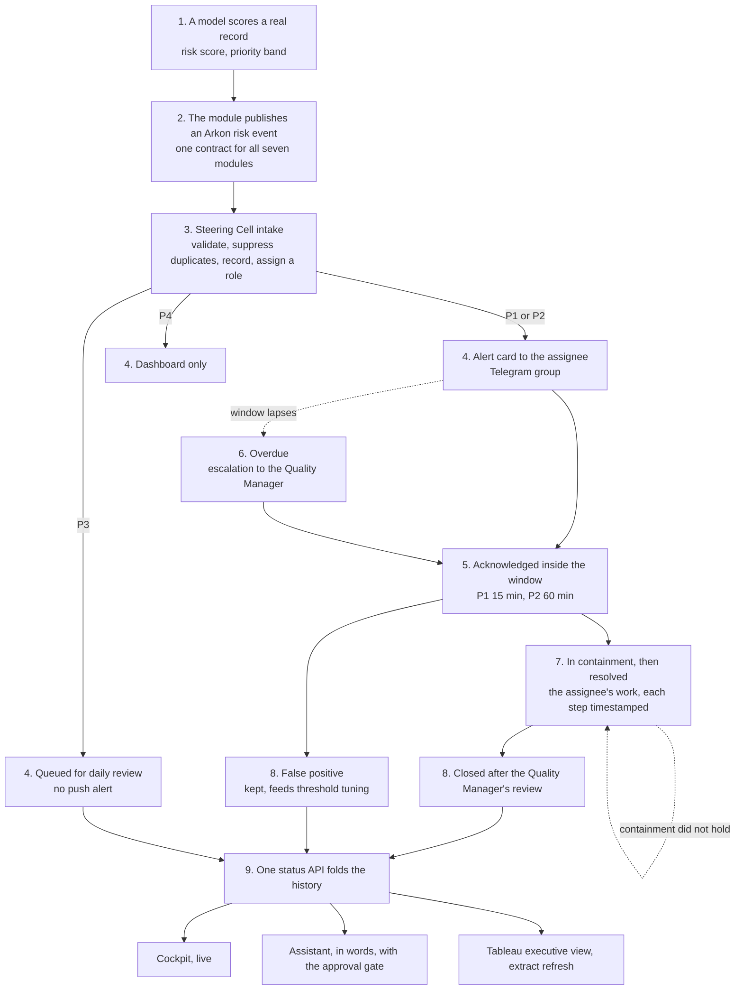

# The Arkon incident process, end to end

One page for two readers. The person on the plant floor who receives a card
needs to know what is expected of them and by when. The person in the boardroom
needs to know what the four numbers on the executive view mean and why one of
them is red. Both are looking at the same chain, and this page walks it once,
from a model scoring a real record to the dashboards, then follows one live
incident through every step with the evidence beside it.

Authority: `Project_Charter.md` section 7 owns the rules, `Steering_Cell_SOP.md`
owns the operator's instructions, `../n8n/README.md` owns the deployment and
`../live_plant/README.md` owns the demo engine that keeps the chain moving. This
page adds nothing to those; it puts them in order.

## The chain in one picture

## The nine steps

| Step | What happens | Who or what | The rule | Where you see it |
|---|---|---|---|---|
| 1. Detect | A model scores one real record: an engine's remaining life, a truck's failure probability, a photograph of a casting, a strip, a component or a sheet, or a month of complaints about one component. The score falls into a priority band that the module declares next to its model. | The module, on real held-out data | Each module documents its own band edges and says whether they were calibrated or declared (model cards, section 5) | The model card and the notebook that produced the number |
| 2. Publish | The module writes one Arkon risk event: twelve mandatory fields, the model's evidence with the record id, and simulated operational context labelled as such. Every module publishes the same contract, so the rest of the chain never knows or cares which model it came from. | The event adapter in `events/` | Charter section 6; `events/validate_event.py` refuses anything else | `events/out/*.jsonl`; on the live plant, the ledger line and the `arkon-2026-9` event id |
| 3. Intake | The Quality Steering Cell validates the contract (a violation is refused with 400 and no incident), suppresses a repeat of the same record and priority inside 24 hours, writes the incident once with an `ARK-INC` id, and assigns a role by business domain: maintenance planner, fleet reliability engineer, QC engineer or field quality analyst. | n8n, `POST /webhook/arkon-event` | Charter 7.3 and 7.6; SOP sections 2, 4 and 6 | The n8n execution list; the incident line in the store; the status API |
| 4. Alert | P1 and P2 put a card in the Telegram group naming the priority, the incident, the summary, the assignee, the recommended action and the event id, and carrying a link that opens the next step on that one incident. P3 is queued for the daily review with no push, so the channel keeps its meaning. P4 is recorded for the dashboard only. | n8n, Telegram | Charter 7.1 and 7.4; SOP sections 3 and 7 | The Telegram group; on the live plant, the ledger's notification block |
| 5. Acknowledge | The assignee reads the card and acknowledges: a P1 within 15 minutes, a P2 within the hour. The acknowledgement is a transition, recorded with the time and the person, and the response-time KPI is measured from that timestamp against the raise time. **Where the assignee does it:** the cockpit's Steering Cell page, "Move this incident" under the incident detail, which offers only the moves allowed from the current state. The card's own link opens that page on the incident it announced, so step 4 reaches step 5 in one tap; the card carries no buttons, because Telegram cannot call back into n8n on this deployment. A terminal route also exists, `n8n/drive_incident.py`. | The assignee, `POST /webhook/arkon-incident-transition` | Charter 7.1 and 7.2; SOP section 8 | The transition log; `minutes_to_acknowledge` and `acknowledged_within_window` on the status API; the cockpit |
| 6. Overdue | If the window lapses with no acknowledgement the incident is overdue. The status API says so on every read, the cockpit and the executive view count it in red, and the Quality Manager is told rather than the window lapsing silently. | The Steering Cell, the escalation contact | Charter 7.1 and 7.4; SOP section 8 step 6 | `overdue` on the status API; the OVERDUE card on both dashboards; the manager card and its line in `/data/arkon/incident_notifications.jsonl`, since 2026-09-06 |
| 7. Work | The assignee decides whether the condition is real, moves the incident into containment, then to resolved when the work is done. Every step is timestamped and carries a note, so the record reads as an account rather than a sequence of words. A containment that does not hold reopens. | The assignee | Charter 7.2; SOP section 8 steps 3 to 5 | The incident's history on the cockpit; the transition log |
| 8. Close or dismiss | The Quality Manager reviews and closes. Or the assignee marks the incident a false positive, which is kept rather than deleted because it is the input to threshold tuning. Both are final. | The Quality Manager; the assignee | Charter 7.2; SOP section 5 | `closed` and `false_positive` counts on the status API and both dashboards |
| 9. See | Nothing on any screen computes a status of its own. The incident line is written once and never rewritten; the current state is the transition log folded onto it, and one status API performs that fold for every consumer. The cockpit shows it live, the assistant answers it in words and can escalate only through a human approval gate, and the executive view reads it through an extract refresh. | The status API, the cockpit, the assistant, Tableau | Charter 7.5 | `http://AK2101:8303`, the Langflow Playground, `tableau/Arkon_Executive_View.twb` |

## The two operator surfaces, and why there are two

The chain above names the cockpit and the assistant one after the other, which
invites a fair question: if the card carries the incident number and the cockpit
carries the queue and the buttons, what is the assistant for? They answer
different questions and only one of them can change anything.

| | The cockpit | The assistant |
|---|---|---|
| Answers | What is open, whose it is, how late it is | Why, and what the rule says |
| Reads | The status API | The status API, plus ten documents in Qdrant |
| Writes | Every lifecycle transition, from "Move this incident" | One escalation record, and only behind a human Approve |
| Cannot | Explain a model's caveat or quote the SOP | Acknowledge, contain, resolve or close |

**What only the assistant has.** The card's recommended action is one line written
by the event adapter. The reasons behind it are in the charter, the SOP and the
seven model cards, and those are the documents nobody opens at 02:00 on a night
shift. So is every caveat that ought to travel with a number: NEU reports 1.0000
accuracy where an un-finetuned baseline already reaches 0.9750 on the same folder,
GC10 does not reproduce, casting misses no defect in the shipped run and misses up
to two across four runs from the same seed. An operator deciding whether a flag is
worth stopping a line for needs the caveat, and no dashboard shows one. The shift
briefing is the other case: the cockpit shows the queue now, the briefing says what
happened across seven modules and four departments during a shift, in a fixed
format that is deliberately not produced by anything that rewords.

**What only the cockpit has.** Hands. It is the only surface that writes a
transition, and it offers only the moves charter 7.2 allows from the current state.

**The assistant hands you over rather than acting for you, and that is a decision
taken on 2026-09-05 rather than a gap.** Ask it about a named incident and the
answer ends with the link that opens that incident on the cockpit and a drafted
note for the transition form: you arrive with the form filled and put your own
name on it. What it will not do is make the move itself. An acknowledgement is
the claim that a named person has seen this and taken it, and the response-time
KPI is measured from that timestamp; an agent that acknowledges turns the plant's
median response time into a measurement of the agent, and a number that keeps
looking reasonable after it stops meaning anything is the worst thing this
platform can produce. It is also the reading a quality auditor takes: a
nonconformance disposition has a human owner. So an approved "acknowledge this
incident" is still refused (`../langflow/README.md`), the agent prepares the
decision, and the person signs it.

## What each reader should take away

**On the plant floor.** A card means one of the models has flagged something on
your line, your fleet or your component, and it is addressed to you by role. Read
it, acknowledge it inside its window, then look at the evidence and decide: the
model is giving you a reason to look, not a verdict. Four moves are yours,
acknowledge, contain, resolve, dismiss as a false positive; closing is the Quality
Manager's. If you cannot acknowledge inside the window, escalate rather than let
it lapse. Nothing in this chain stops a line, orders maintenance or scraps a part;
every consequential action is a person's.

**In the boardroom.** Four numbers say whether the plant is on top of its
incidents: how many are open, how many of those are past their window, what share
of acknowledgements happened inside the window, and the median time to
acknowledge. Red on the executive view means exactly one thing, a response window
that has run out; everything else is neutral on purpose. Behind the four numbers
is one append-only record of every raise and every move, timestamped and
attributed, which is why the response times are measured rather than reported.

## One live incident, traced

The live plant (`../live_plant/README.md`) raises real-model incidents on a clock
so this chain can be watched rather than described. The first incident it raised
after being started as a service on the NAS, 2026-09-05:

| Step | What happened | Evidence |
|---|---|---|
| 1. Detect | The CMAPSS model's prediction for engine unit 194 of FD004 fell into the P2 band (remaining useful life inside 25 cycles). | `events/out/cmapss_events_full_fleet.jsonl`, the batch event the plant re-timed |
| 2. Publish | The plant published it at 18:01:48 as `arkon-2026-900008`, shift B, assigned to the maintenance planner M. Brandt, `operational_context` labelled simulated and naming the emitter. | Ledger line, tick 8 |
| 3. Intake | The Steering Cell validated it, found no duplicate, recorded `ARK-INC-00047` and answered `incident_created_alert_sent`. | The status API returns the incident with `raised_as: new` |
| 4. Alert | A P2 card went to the Telegram group, addressed to M. Brandt, with the recommended action "Schedule inspection before the next operating window." | The ledger's notification block; the card in the group |
| 5. Acknowledge | The crew acknowledged it in the same tick as M. Brandt, `ARK-TRN-00017`, 0 minutes after the raise, inside the 60-minute window. | `acknowledged_within_window: true` on the transition record |
| 6. Overdue | Not reached: the window was met. | `overdue: false` on the status API |
| 7 and 8. Work and close | Pending as this page was written; the same tick closed an earlier live incident, `ARK-INC-00040`, as the Quality Manager R. Ortiz, "reviewed and closed by the Quality Manager", `ARK-TRN-00018`. | The transition log |
| 9. See | The cockpit's pulse moved from 36 incidents and 16 transitions to 37 and 18; the extract refresh wrote 37 incident rows and 18 transition rows with `ARK-INC-00047` acknowledged at 0 minutes and the store's median time to acknowledge at 0.8 minutes where it had been 3,941; the workbook regenerated from those extracts. | `tableau/extracts/store_summary.csv` as of 16:06 UTC |

## Where the process is enforced, and what is not built

Enforced by the deployment rather than by instruction: the event contract (a bad
event never becomes an incident), the 24-hour duplicate suppression, the
append-only store with its fold, the lifecycle machine (an illegal move is refused
with 409 naming what is allowed), the alert channel reserved for P1 and P2, and
the response-time KPIs computed from timestamps. Enforced on the demo engine's
side: an alert budget, because every card is real.

Not built, and said plainly so the chain is read as it is: the acknowledge and
close buttons on the card itself (on this deployment Telegram cannot call back
into n8n; the operator's controls are on the cockpit instead, since 2026-09-05),
the daily digest, and one unified log of every notification sent. The manager
notification for a lapsed window left this list on 2026-09-06: built as
`n8n/overdue_escalation_v1.json` and deployed (`../n8n/README.md`, "Overdue escalation"). The assistant can report every state and
can escalate through its approval gate; it cannot acknowledge or close, by
design.

## The same chain, in a classical quality process and here

| | A classical nonconformance process | The Arkon Steering Cell |
|---|---|---|
| Detection | Starts when a person notices a defect or a complaint arrives | Seven models score real records continuously and raise the flag with the evidence attached |
| Triage | A nonconformance report is opened by hand; priority and owner are judgement calls | One contract, one intake: priority bands, duplicate suppression and assignment by domain applied automatically, identically, in seconds |
| Escalation | Emails and the next meeting | A card to the responsible role at once, a known response window, and overdue as a fact the system holds |
| Record | A form in the QMS, updated when someone gets to it | Append-only, timestamped, attributed; response times are measured, not reported |
| The rules | In documents few people open | A grounded assistant answers from the SOP, the charter and the model cards, and from the live store, in words |
| The decision | A person's | A person's. That is the point: the platform improves detection, routing, speed and transparency, and leaves judgement where it was |
