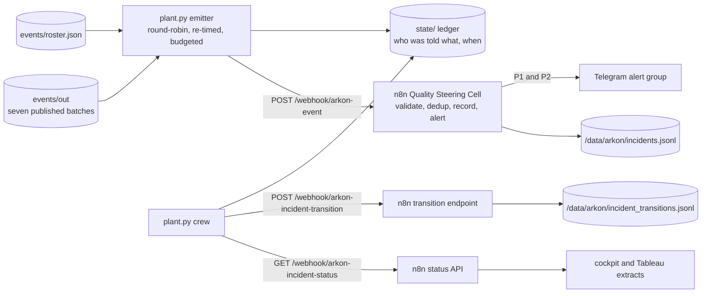

# The live plant: the Arkon demo engine

A mini-project inside Arkon, built 2026-09-05. It makes the platform move the way
a plant does while somebody watches: one real-model incident every ten minutes
or so across all seven modules, and a simulated crew that acknowledges,
contains, resolves, closes and reopens what it raised. Everything downstream is
the real deployment: the n8n Quality Steering Cell validates and records the
events, Telegram carries the P1 and P2 cards, the status API folds the lifecycle,
and the cockpit and the executive view show it.

It exists because the executive view has to be judged against a moving store.
A dashboard over 29 incidents that were raised on one afternoon and never moved
cannot show what the Steering Cell is for; a plant that raises, alerts, gets
acknowledged late and on time, and closes can. The chain it exercises, step by
step and traced on one of its own incidents, is `docs/Incident_Process.md`.

| File | Purpose |
|---|---|
| `plant.py` | The emitter and the crew, stdlib only. `tick`, `run`, `status`, `reset` |
| `check_plant.py` | Offline suite: 46 checks against a fake Steering Cell with the deployed workflows' answers and a fake clock |
| `state/` | The ledger, gitignored: `state.json`, `emitted.jsonl`, `transitions.jsonl` |
| `../app/docker-compose.yml` | The `live-plant` service, behind the `live` profile |

```bash
python live_plant/plant.py tick --dry-run          # draw one event, print it, send nothing
python live_plant/plant.py run                     # every ~10 min until Ctrl-C, 6 cards per hour at most
python live_plant/plant.py run --ticks 7 --interval 30 --max-alerts-per-hour 3   # a bounded burst
python live_plant/plant.py status                  # coverage, budget, pools, the live store
python live_plant/plant.py reset                   # print the archive plan; --execute --host user@nas runs it
python live_plant/check_plant.py                   # the offline suite
```

## How it sits in the platform



**It is not an n8n workflow, and that is a decision rather than an omission.** The
realism comes from the seven batch files and the contract validator in
`events/`, which live in the repository; a Code node would need those files
copied to the NAS and a second copy of the sampling logic in JavaScript, testable
only inside n8n. As a Python service beside the cockpit it is testable offline
against a fake cell, reads the batches where they are, and calls the three
endpoints like any other client. What n8n shows of it is the truth about it: one
execution of the Steering Cell per event, one of the transition endpoint per
crew move, in the same execution list as everything else.

## What it emits, and what it does not invent

**Every event is real model output, re-timed.** The emitter draws from the
module's own published batch in `events/out/`, so the summary, the record id, the
prediction and the threshold are what the model said about a real engine, truck,
casting, strip, component, sheet or complaint cell; `evidence` is copied
untouched and `context_origin` stays `real` because it is. What changes is the
timing and the simulated context: `event_id` moves to the `arkon-2026-9xxxxx`
series, so the id on a Telegram card says on its own that the plant is running
rather than a batch being replayed; `event_time` is now; the shift follows the
plant clock (A 06-14, B 14-22, C 22-06, Berlin time); the assignee rotates within
the domain's role from `events/roster.json`; and `operational_context` names the
emitter, its run and the batch event it came from (`emitter`, `emitter_run`,
`replayed_from`), all under the `context_origin: simulated` label of charter
section 5. Every event goes through `events/validate_event.py` before it is sent.

**Priorities follow the published band mix.** The priority of a tick is drawn
with the module's own batch counts as weights, so MVTec raises P2 about 85 per
cent of the time and NEU about 1 per cent, exactly as they publish. P4 is not
drawn unless `--include-p4` says so: CMAPSS is the only module that publishes a
P4 band (481 of its 707 events, a dashboard-only band under charter 7.1) and every
replay so far has left it out, which is why the store has never held one. The
absence of P4 on the dashboards is therefore a switch, not a design fact.

**Coverage is guaranteed by construction.** The modules are visited round-robin
in a fixed order, alternating departments where the count allows: seven
consecutive ticks cover all seven modules and all four domains, and fourteen
visit each module exactly twice. Four of the seven modules are `visual_inspection`,
so one adjacent pair in that domain is unavoidable in a cycle of seven.

**Every P1 and P2 is a real Telegram card, so the emitter is budgeted.** At most
`--max-alerts-per-hour` alerting events go out (default 6). When the budget is
spent, the tick draws a non-alerting priority from the same module instead of
skipping, so the plant keeps moving and the department is still covered; the
ledger line records the priority the mix drew and the one that was sent. At ten
minutes a tick with the mixes above, about a third of ticks alert, so the default
budget rarely binds.

**The 24-hour dedup at intake is honoured from this side.** A record id and
priority sent in the last 24 hours is not drawn again, because intake would
answer `duplicate_suppressed` and the tick would raise nothing. NHTSA is the tight
pool: 25 cells, visited about twenty times a day at the default cadence. A module
whose pool is spent inside the window is skipped with a reason and the cursor
moves on.

**Two ledgers can exist and the numbering survives it.** The laptop runs bounded
bursts, the NAS service runs demos, and a fresh ledger would start the live series
at 1. Intake would not refuse a repeated event id, since dedup is on record id
plus priority, so the first tick of a fresh ledger reads the store through the
status API and continues above the highest live id it finds. Run one emitter at a
time all the same: two crews moving the same incidents would race each other.

## The crew

The crew reads the open incidents through the status API and moves some of them
through the transition endpoint, so the lifecycle KPIs come out of real
timestamps rather than a script's arithmetic. Per tick, per incident, as
probabilities (`CREW` in `plant.py`):

| From | Move | Per tick |
|---|---|---|
| new | acknowledged | P1 0.85, P2 0.30, P3 0.15, P4 0.05 |
| new | false_positive | 0.03 |
| acknowledged | in_containment | 0.35 |
| acknowledged | resolved (minor fix) | 0.15 |
| acknowledged | false_positive | 0.08 |
| in_containment | resolved | 0.35 |
| resolved | closed (Quality Manager) | 0.40 |
| resolved | in_containment (reopen) | 0.04 |

At the default cadence a P1 is acknowledged inside its fifteen-minute window most
of the time and a P2 inside its hour about nine times in ten, so the overdue block
is never empty for long and never the whole store. The assignee makes every move
except two: closure is the Quality Manager's, per SOP section 8, and the reopen
note says the containment did not hold. Each module has its own operator notes,
so the transition log reads as an account rather than as a sequence of status
words.

Three guards. The crew only moves incidents this emitter raised (the live event
series, or an incident id on its own ledger), so the legacy store and the
incidents the 2B demo script names are never touched unless `--crew-all` is
passed. At most `--max-transitions-per-tick` moves per tick (default 3),
acknowledgements of alerting incidents first. And a status API answer other than
`ok` or `no_match` moves nothing that tick: a 503 read as "nothing open" would be
charter 7.6's failure on a new surface. Every requested move is legal per
`n8n/build/lifecycle.py` before it is sent; the endpoint stays the authority and
would answer 409 otherwise.

## The ledger: who was told what, and when

Three files under `state/` (on the NAS, `/volume1/docker/arkon/live_plant/`):

| File | One line per |
|---|---|
| `state.json` | the run id, the next event number, the next tick, the round-robin cursor, whether the numbering was seeded from the store, the resets |
| `emitted.jsonl` | tick: module, domain, priority drawn and sent, record id, event id, the batch event it came from, intake's HTTP code and `status`, the incident id it created, and a `notification` block when a card went out |
| `transitions.jsonl` | crew move: incident, from, to, actor, note, the endpoint's answer, `acknowledged_within_window` |

The `notification` block is what the executive view needs:

| Field | Meaning |
|---|---|
| `channel`, `chat` | `telegram`, the Arkon alert group the intake workflow posts to |
| `addressed_to`, `role` | the simulated assignee named on the card |
| `escalation_contact` | who is next if the acknowledgement window lapses (SOP section 6) |
| `sent_by` | the intake workflow's alert branch |
| `at` | when intake answered |
| `delivery_confirmed` | always `false` from this side |

**It is intake's answer, not a delivery receipt.** DEFECT-8 (`n8n/README.md`) is
exactly the case where the workflow said a card was sent and Telegram had refused
it, so a card is confirmed by a person reading the group, and the run log records
it that way. There are two sources of notifications on this platform and they are
not yet one log: this ledger for the intake cards, and
`/data/arkon/incident_notifications.jsonl` for the Quality Manager cards, written by
`n8n/overdue_escalation_v1.json` since 2026-09-06. Unifying them is the intake workflow
appending its own notification line after the Telegram node, which is the one-node
change of charter 7.6's shape and is not built.

## Reset: archive, never rewind

The store cannot be rewound. Its files are append-only and the incident,
transition and escalation counters live in n8n's workflow static data, so a
reset is an archive: `plant.py reset` prints, and with `--execute` runs over SSH,
one `docker exec n8n sh -c` script that moves every existing store file
(`incidents`, `incident_transitions`, `escalations`, `incident_notifications`) into
`/data/arkon/_archive/<stamp>/` and creates a fresh empty one in its place, as the
container user, because the append node cannot create a file (`n8n/README.md`,
trap 3). It stops at the first error and deletes nothing. Afterwards the counters
keep counting, so the first incident of the new store is not `ARK-INC-00001`,
which is honest: the store has never been a complete history of every id issued.
The emitter keeps its 24-hour dedup memory across the reset, because intake keeps
its own, and starts a new run id so `status` and the ledger separate before from
after.

**Two things to know before pressing it.** The 2B demo script rehearsed on
2026-09-03 names specific incidents (`ARK-INC-00012` and the closed paths of
Phase 4); a reset before the presentation moves them into the archive and the
rehearsed turns no longer find them. Reset after the presentation, or re-point
the script. And the SSH target is not in this repository: pass `--host user@nas`
or set `ARKON_NAS_SSH`.

## Running it on the NAS

The `live-plant` service in `app/docker-compose.yml` runs the emitter from the
cockpit image (the Dockerfile copies `live_plant/plant.py` and `events/` in), on
the same network as n8n, reaching it by the dotted alias. It sits behind the
`live` profile so a plain `up -d` of the cockpit never starts it. From
`/volume1/docker/arkon-cockpit` on the NAS:

```bash
docker compose -f app/docker-compose.yml --env-file .env --profile live up -d live-plant   # start the plant
docker compose -f app/docker-compose.yml --env-file .env --profile live logs -f live-plant  # watch it
docker compose -f app/docker-compose.yml --env-file .env --profile live stop live-plant     # stop it
```

Started, it raises an incident every eight to twelve minutes and sends a card for
about a third of them, six an hour at most, until stopped. That is what "live
whenever it is shown" costs, and it is why the service is never started by a
cockpit deploy. The ledger persists at `/volume1/docker/arkon/live_plant/` beside
the store. The deploy copy on the NAS needs `live_plant/plant.py` and `events/`
beside `app/`, `assets/` and `models/`; the image is rebuilt with `--build`.

## How it was verified

**Offline first.** `check_plant.py` drives the emitter against a fake Steering
Cell that answers like the deployed workflows (contract validation, 24-hour dedup
on record id plus priority, the four intake outcomes, a status API filtered by
lifecycle state, a transition endpoint enforcing charter 7.2 with a 409) under a
fake clock. 46 checks: seven ticks cover every module and domain and fourteen
visit each twice; every event passes the real validator, carries the live id
series and the emitter labels, and leaves the evidence untouched; 140 ticks in 23
hours produce no duplicate and no skip; a budget of two per hour holds over 30
ticks in 30 minutes with the substitutions recorded; MVTec draws P2 at its
published share; P4 is admitted only on request; the crew asks for no illegal
move over 80 ticks, never touches a legacy incident unless `--crew-all`, closes as
the Quality Manager, reaches every lifecycle state, respects the per-tick cap and
the ordering, and moves nothing on a 503; a fresh ledger continues the numbering
above the store's highest live id; the same seed gives the same plant; a spent
pool is skipped and the cursor advances; a dry run writes nothing; the reset plan
archives under a stamp, moves and re-creates each file, stops at the first error
and never deletes.

**Then live, bounded: the first run, 2026-09-05.** Seven ticks from the laptop,
twenty seconds apart, alert budget three per hour, seed 2026: one incident per
module, `ARK-INC-00040` to `00046`, ids continuing from the store's 39. Two cards
went out per intake's answer, `ARK-INC-00042` (P1, Scania truck
`SCANIA-APS-007208`, addressed to M. Sato) and `ARK-INC-00045` (P2, MVTec
`TRANSISTOR-DAMAGED_CASE-001`, A. Novak); five P3 were recorded without a card.
**Both cards were confirmed by Sergey reading them off the Telegram group**, at
17:38 and 17:39, each carrying the priority, the incident id, the summary, the
assignee, the recommended action and the `arkon-2026-9` event id, which is the
DEFECT-8 discipline and closes the run. The crew then moved four of the seven
inside the same run, `ARK-TRN-00012` to `00016`: both alerting incidents
acknowledged by their assignee inside the window (0.4 and 0 minutes), the CMAPSS
P3 acknowledged and resolved with the module's own notes, and the MVTec P2 marked
`false_positive` after inspection. The store went from 29 to 36 incidents and 11
to 16 transitions, and the response-time block changed shape: five acknowledged,
two within window and two late (the two legacy ones), median time to acknowledge
1.1 minutes where it had been 3,941.

The same evening the image was rebuilt on the NAS with the emitter inside it, the
cockpit recreated from it, and the `live-plant` service verified from inside the
network with a dry tick and a `status` that reached the store through the dotted
alias. The service was left stopped.

## Boundaries

- **It cannot see whether a card arrived.** Intake's answer is what it records;
  the group is the evidence. A unified notification log would need the intake
  workflow to write one.
- **It moves only what it raised.** The legacy backlog stays as it is unless
  `--crew-all` is passed, so a demo store carries two populations: the incidents
  of 2026-08-30 to 09-03 that nobody acknowledged for days, and the live ones.
  A reset is the way to one population, and it is an archive.
- **The crew is a probability table, not a shift plan.** It has no notion of
  working hours, headcount or a queue; at the default cadence it produces a
  plausible mix of on-time and late acknowledgements and that is all it is for.
- **The pools are the batches.** Realism comes from real model output, which also
  means the plant can only ever raise what the seven models flagged on their test
  sets; a model that flags 25 cells gives a module 25 possible incidents a day.
- **No authentication on anything it calls**, same as the rest: LAN and Tailscale
  only.
